```{r setup, include=FALSE}
knitr::opts_chunk$set(echo = FALSE)
library(here)
```


<p style="font-size: 0.7em; color: gray;"> Created on July 28, 2025 </p>

## [*Maxime Marini, Callum Gapes, Andrea S. Griffin*]{style="font-size: 0.8em;"}

\

# [Material]{.smallcaps}

Multiple variables might influence the movement of migratory shorebirds within there foraging ground (ie. Hunter & Port Stephen estuaries), selecting different areas at different times whether to roost or forage. Those variables might vary across species and individuals, therefore their selected habitat. Within such an interdependent system, we try to suggest an approach that takes into account the tidal and circadian cycles as the main drivers to the habitat selection.

1.  **MOTUS telemetry technology**

<p style="font-size: 0.9em; color: gray;">

*Overview about the MOTUS array and its combination with Lotek VHF devices used within the study. How does this work?*

</p>

2.  **The local MOTUS array**

<p style="font-size: 0.9em; color: gray;">

*See how, where and where our array is set-up.*

</p>

3.  **The deployed tags**

<p style="font-size: 0.9em; color: gray;">

*Keep track on what tags are deployed over our migratory shorebirds.*

</p>

::: blockquote-blue
Navigate the three different tabs below to get deeper into the [material]{.smallcaps} used.
:::

::: panel-tabset
## Close tabs

## 1. MOTUS telemetry technology

To be continued ...

## 2. The local MOTUS array

To be continued ...

## 3. The deployed tags

### [Contents]{#contents03 style="color: grey; font-size: smaller;"}

-   [VHF monitoring: overview](#overview)
-   [Trapping: details](#details)
-   [Detected birds](#detected)
-   [Undetected birds](#undetected)
-   [Euthanasied birds](#euthanasied)

---

### VHF monitoring: overview {#overview}

```{r 03 data overview DOUBLE FOR GENERATING PLOT text for moni object, message = FALSE, warning = FALSE, eval = TRUE, echo = FALSE}
library(dplyr)
tryCatch({
  write.csv(
    readxl::read_excel("C:/Users/c3541851/The University of Newcastle/StudentGroupPhD - Louise Williams and Mattea Taylor - General/SHOREBIRD NUMBER TRACKING.xlsx"),
    file.path(here::here("1_data", "spreadsheets"), paste0(Sys.Date(), "-teams.sheet", ".csv")),
    row.names = FALSE
  )
}, error = function(e) {
  write.csv(
    readxl::read_excel("C:/Users/marin/The University of Newcastle/StudentGroupPhD - Louise Williams and Mattea Taylor - General/SHOREBIRD NUMBER TRACKING.xlsx"),
    file.path(here::here("1_data", "spreadsheets"), paste0(Sys.Date(), "-teams.sheet", ".csv")),
    row.names = FALSE
  )
})

spreadsheet <- read.csv(here::here("1_data", "spreadsheets", paste0(Sys.Date(), "-teams.sheet.csv"))) %>%
  filter(Radio.tag. == "Y") %>%     
  rename(DateAUS.Trap = "Date", motusTagID = "Motus.tag.ID") %>% 
  mutate(motusTagID = as.factor(motusTagID))
data_all <- readRDS(
  tail(sort(list.files(
    here::here("1_data", "alltags", "motus.rds"),
    pattern = "-data\\.rds$", full.names = TRUE
  )), 1))
nb_undetect <- spreadsheet %>% 
  filter(is.na(Euthanised.)) %>%
  distinct(Band.ID) %>%
  filter(!Band.ID %in% unique(data_all$Band.ID))
nb_release <- spreadsheet %>% 
  filter(is.na(Euthanised.),
         is.na(Retagged.))
moni <- bind_rows(
  tibble(variable = "nb_tagged",
         value  = length(spreadsheet$Band.ID)),
  tibble(variable = "nb_euthanised",
         value  = sum(spreadsheet$Euthanised. == "Y", na.rm = TRUE)),
  tibble(variable = "nb_retagged",
         value  = sum(!is.na(spreadsheet$Retagged.))),
  tibble(variable = "nb_released",
         value  = nrow(nb_release)),
  tibble(variable = "detect_0",
         value  = nrow(nb_undetect)),
  tibble(variable = "detect_inf_150",
         value  = data_all %>%
           count(Band.ID) %>%
           filter(n < 150) %>% 
           nrow() ),
  tibble(variable = "detect_sup_150",
         value  = data_all %>%
           count(Band.ID) %>%
           filter(n > 149) %>% 
           nrow() )
)
undetect <-  spreadsheet %>% 
  filter(Band.ID %in% nb_undetect$Band.ID) %>%
  select(Band.ID, motusTagID, Species, DateAUS.Trap, everything())

eutha <-  spreadsheet %>% 
  filter(Euthanised.== "Y") %>%
  select(Band.ID, motusTagID, Species, DateAUS.Trap, everything())
```

Since 2021, we trapped `r moni$value[moni$variable == "nb_tagged"]` birds, and `r moni$value[moni$variable == "nb_released"]` were released with a MOTUS tag, and potentially detectable across our automated telemetry array. Since then, several species have been monitored, with surveying varying across space and time as reflected by the coverage of our Motus stations (Table 1).
Also, we distinguish three classes of automated telemetry monitoring: no detection, under 150 detections and over 150 detections (Table 2).

```{r 03 TABLE 1 , message = FALSE, warning = FALSE, eval = TRUE, echo = FALSE}
# 1 - Packages ----

library(motus)
library(dplyr)
library(here)
library(forcats) 
library(ggplot2)
library(lubridate)
library(tidyr)
library(purrr)

# 2 - Load data ----

# Birds
data_all <- readRDS(
  tail(sort(list.files(
    here::here("1_data", "alltags", "motus.rds"),
    pattern = "-data\\.rds$", full.names = TRUE
  )), 1))  %>%
  mutate(DateAUS.Trap = as.Date(DateAUS.Trap),
         dateAus = as.Date(dateAus))

# Receivers info
recv <- readRDS(
  tail(sort(list.files(
    here::here("1_data", "alltags", "motus.rds"),
    pattern = "-recv-info\\.rds$", full.names = TRUE
  )), 1)) 

# Tagging/Trapping info
tryCatch({
  write.csv(
    readxl::read_excel("C:/Users/c3541851/The University of Newcastle/StudentGroupPhD - Louise Williams and Mattea Taylor - General/SHOREBIRD NUMBER TRACKING.xlsx"),
    file.path(here::here("1_data", "spreadsheets"), paste0(Sys.Date(), "-teams.sheet", ".csv")),
    row.names = FALSE
  )
}, error = function(e) {
  write.csv(
    readxl::read_excel("C:/Users/marin/The University of Newcastle/StudentGroupPhD - Louise Williams and Mattea Taylor - General/SHOREBIRD NUMBER TRACKING.xlsx"),
    file.path(here::here("1_data", "spreadsheets"), paste0(Sys.Date(), "-teams.sheet", ".csv")),
    row.names = FALSE
  )
})
spreadsheet <- read.csv(here::here("1_data", "spreadsheets", paste0(Sys.Date(), "-teams.sheet.csv"))) %>%
  filter(Radio.tag. == "Y") %>%     
  rename(DateAUS.Trap = "Date", motusTagID = "Motus.tag.ID", speciesEN = "Species") %>% 
  mutate(motusTagID = as.factor(motusTagID)) %>%
  select(Band.ID, motusTagID, speciesEN, DateAUS.Trap, everything())  %>%
  mutate(speciesEN = case_when(
    speciesEN == "Eastern Curlew" ~ "Far Eastern Curlew",
    speciesEN == "Black-winged Stilt" ~ "Pied Stilt",
    speciesEN == "Pacific Golden Plover" ~ "Pacific Golden-Plover",
    TRUE ~ speciesEN 
  ))

```

```{r 03 TABLE 1bis , message = FALSE, warning = FALSE, eval = TRUE, echo = FALSE}

# Nb of individual equipped
nb_tagged <- spreadsheet %>% 
  group_by(speciesEN) %>% # per species
  summarise(nb_tagged = n())

# Nb of individual never detected
nb_undetect <- data_all %>%
  distinct(speciesEN) %>% # to force including all values of species                        
  left_join(spreadsheet %>%
              filter(is.na(Euthanised.),
                     !Band.ID %in% unique(data_all$Band.ID)) %>%
              group_by(speciesEN) %>%
              summarise(nb_undetect = n(), .groups = "drop"),
            by = "speciesEN") %>%
  mutate(nb_undetect = ifelse(is.na(nb_undetect), 0, nb_undetect))

# Nb of individual re-tagged
nb_retagged <- data_all %>%
  distinct(speciesEN) %>% # to force including all values of species                        
  left_join(spreadsheet %>%
              filter(is.na(Euthanised.),
                     !is.na(Retagged.)) %>%
              select(Band.ID, speciesEN, DateAUS.Trap, Location) %>%
              group_by(speciesEN) %>% # per species
              summarise(nb_retagged = n()),
            by = "speciesEN") %>%
  mutate(nb_retagged = ifelse(is.na(nb_retagged), 0, nb_retagged))

# First day monitored (trapping/tagging) 
first_d <- spreadsheet %>% 
  group_by(speciesEN) %>% # per species
  mutate(first_d = min(DateAUS.Trap)) %>%
  select(speciesEN, first_d) %>%
  unique() %>%
  mutate(first_d = format(as.Date(first_d), format = "%d-%m-%Y"))

# Last day recorded (detection)
last_d <- data_all %>% 
  group_by(speciesEN) %>% # per species
  mutate(last_d = max(dateAus)) %>%
  select(speciesEN, last_d) %>%
  unique()%>%
  mutate(last_d = format(last_d, format = "%d-%m-%Y"))

# Nb of days monitored, total period of detection (mean + SE)
monit_d <- data_all %>%
  
  group_by(Band.ID) %>% # per individual
  summarise(DateAUS.Trap = first(DateAUS.Trap),         
            last_dateAus = max(dateAus),
            monit_d = as.numeric(last_dateAus - DateAUS.Trap) + 1) %>% 
  left_join(data_all %>% select(Band.ID, speciesEN) %>% distinct(), by = "Band.ID") %>%
  
  group_by(speciesEN) %>% # per species
  summarise(n_indiv = n(),
            mean_monit_d = round(mean(monit_d), 1),
            se = sd(monit_d)/sqrt(n_indiv),
            se_lower = mean_monit_d - 1.96*se,
            se_upper = mean_monit_d + 1.96*se,
            mean_monit_d_se = ifelse(is.na(se), 
                                     paste0(" \u00B1 0") , 
                                     paste0(" \u00B1 ", round(se, 1)))) %>%
  ungroup() %>%
  select(speciesEN, mean_monit_d, mean_monit_d_se)

# Nb of days actually detected (mean + SE)
detect_d <- data_all %>%
  
  group_by(Band.ID) %>% # per individual
  summarise(detect_d = n_distinct(dateAus)) %>%
  ungroup()  %>% 
  left_join(data_all %>% select(Band.ID, speciesEN) %>% distinct(), by = "Band.ID") %>%
  
  group_by(speciesEN) %>% # per species
  summarise(n_indiv = n(),
            mean_detect_d = round(mean(detect_d), 1),
            se = sd(detect_d)/sqrt(n_indiv),
            se_lower = mean_detect_d - 1.96*se,
            se_upper = mean_detect_d + 1.96*se,
            mean_detect_d_se = ifelse(is.na(se), 
                                      paste0(" \u00B1 0") , 
                                      paste0(" \u00B1 ", round(se, 1)))) %>%
  ungroup() %>%
  select(speciesEN, mean_detect_d, mean_detect_d_se)

# Nb of sites visited per day (mean + SE)
sites_d <- data_all %>%

  group_by(Band.ID, dateAus) %>% # per individual and day
  summarise(nb_sites = n_distinct(recvDeployName), .groups = "drop") %>%  
  group_by(Band.ID) %>%  
  summarise(nb_sites_d = round(mean(nb_sites), 1)) %>%
  ungroup()  %>% 
  left_join(data_all %>% select(Band.ID, speciesEN) %>% distinct(), by = "Band.ID") %>%
  
  group_by(speciesEN) %>% # per species
  summarise(n_indiv = n(),
            mean_sites_d = round(mean(nb_sites_d), 1),
            se = sd(nb_sites_d)/sqrt(n_indiv),
            se_lower = mean_sites_d - 1.96*se,
            se_upper = mean_sites_d + 1.96*se,
            sites_d_se = ifelse(is.na(se), 
                                paste0(" \u00B1 0") , 
                                paste0(" \u00B1 ", round(se, 1)))) %>%
  ungroup() %>%
  select(speciesEN, mean_sites_d, sites_d_se)

# Nb of sites visited in total (mean + SE)
sites_tot <- data_all %>%
  
  group_by(Band.ID) %>% # per individual
  summarise(sites_tot = n_distinct(recvDeployName), .groups = "drop") %>%  
  ungroup()  %>% 
  left_join(data_all %>% select(Band.ID, speciesEN) %>% distinct(), by = "Band.ID") %>%
  
  group_by(speciesEN) %>% # per species
  summarise(n_indiv = n(),
            mean_sites_tot = round(mean(sites_tot), 1),
            se = sd(sites_tot)/sqrt(n_indiv),
            se_lower = mean_sites_tot - 1.96*se,
            se_upper = mean_sites_tot + 1.96*se,
            sites_tot_se = ifelse(is.na(se), 
                                  paste0(" \u00B1 0") , 
                                  paste0(" \u00B1 ", round(se, 1)))) %>%
  ungroup() %>%
  select(speciesEN, mean_sites_tot, sites_tot_se)
```

```{r 03 TABLE 1tris, message = FALSE, warning = FALSE, eval = FALSE, echo = FALSE}

# 1 - Gather variables ----

table_1 <- list(nb_tagged,     # nb of individual tagged
                nb_undetect,   # nb of individual undetected
                nb_retagged,   # nb of individual re-tagged
                first_d,       # first day of the first individual tagged
                last_d,        # last day of the last individual detected
                monit_d,       # nb of days between first_d and last_d for each individual
                detect_d,      # nb of days each individual have been detected at least once
                sites_d,       # mean for the nb of sites each individual visited per day
                sites_tot) %>% # total nb of sites each individual visited
  
  reduce(left_join, by = "speciesEN") # all the variables are accessed at species level


# 2 - Display table 1 ----

# Last modifications
table_1_pub <- table_1 %>%
  mutate(monit_d   = ifelse(is.na(mean_monit_d_se), mean_monit_d,paste0(mean_monit_d, "  ", mean_monit_d_se)),
         detect_d  = ifelse(is.na(mean_detect_d_se), mean_detect_d,paste0(mean_detect_d, "  ", mean_detect_d_se)),
         sites_d   = ifelse(is.na(sites_d_se), mean_sites_d,paste0(mean_sites_d, "  ", sites_d_se)),
         sites_tot = ifelse(is.na(sites_tot_se), mean_sites_tot, paste0(mean_sites_tot, "  ", sites_tot_se))) %>%
  left_join(data_all %>% distinct(speciesEN, speciesSci), by = "speciesEN") %>%
  filter(!is.na(speciesSci)) %>%
  select(speciesEN, speciesSci, nb_tagged, nb_undetect, nb_retagged, first_d, last_d, monit_d, detect_d, sites_d, sites_tot) %>%
  rename(species_eng = "speciesEN",
         species_sci = "speciesSci")

# Final
DT::datatable(
  table_1_pub,
  options = list(
    scrollX = TRUE,
    pageLength = 10,
    fixedColumns = list(leftColumns = 2)),
  extensions = c('FixedColumns'),
  caption = 'Table 1: Shorebirds monitoring with local MOTUS automated telemetry array.') %>%
  DT::formatStyle('species_eng',
                  fontWeight = 'bold')

```

```{r 03 data overview DOUBLE FOR GENERATING PLOT, message = FALSE, warning = FALSE, eval = TRUE, echo = FALSE}
library(dplyr)
tryCatch({
  write.csv(
    readxl::read_excel("C:/Users/c3541851/The University of Newcastle/StudentGroupPhD - Louise Williams and Mattea Taylor - General/SHOREBIRD NUMBER TRACKING.xlsx"),
    file.path(here::here("1_data", "spreadsheets"), paste0(Sys.Date(), "-teams.sheet", ".csv")),
    row.names = FALSE
  )
}, error = function(e) {
  write.csv(
    readxl::read_excel("C:/Users/marin/The University of Newcastle/StudentGroupPhD - Louise Williams and Mattea Taylor - General/SHOREBIRD NUMBER TRACKING.xlsx"),
    file.path(here::here("1_data", "spreadsheets"), paste0(Sys.Date(), "-teams.sheet", ".csv")),
    row.names = FALSE
  )
})
spreadsheet <- read.csv(here::here("1_data", "spreadsheets", paste0(Sys.Date(), "-teams.sheet.csv"))) %>%
  filter(Radio.tag. == "Y") %>%     
  rename(DateAUS.Trap = "Date", motusTagID = "Motus.tag.ID") %>% 
  mutate(motusTagID = as.factor(motusTagID)) %>%
    select(Band.ID, motusTagID, Species, DateAUS.Trap, everything())

data_all <- readRDS(
  tail(sort(list.files(
    here::here("1_data", "alltags", "motus.rds"),
    pattern = "-data\\.rds$", full.names = TRUE
  )), 1))
nb_undetect <- spreadsheet %>% 
  filter(is.na(Euthanised.)) %>%
  distinct(Band.ID) %>%
  filter(!Band.ID %in% unique(data_all$Band.ID))
nb_detect <- spreadsheet %>% 
  filter(is.na(Euthanised.)) %>%
  distinct(Band.ID) %>%
  filter(Band.ID %in% unique(data_all$Band.ID))
nb_release <- spreadsheet %>% 
  filter(is.na(Euthanised.),
         is.na(Retagged.))
moni <- bind_rows(
  tibble(variable = "nb_tagged",
         value  = length(spreadsheet$Band.ID)),
  tibble(variable = "nb_euthanised",
         value  = sum(spreadsheet$Euthanised. == "Y", na.rm = TRUE)),
  tibble(variable = "nb_retagged",
         value  = sum(!is.na(spreadsheet$Retagged.))),
  tibble(variable = "nb_released",
         value  = nrow(nb_release)),
  tibble(variable = "detect_0",
         value  = nrow(nb_undetect)),
  tibble(variable = "detect_inf_150",
         value  = data_all %>%
           count(Band.ID) %>%
           filter(n < 150) %>% 
           nrow() ),
  tibble(variable = "detect_sup_150",
         value  = data_all %>%
           count(Band.ID) %>%
           filter(n > 149) %>% 
           nrow() )
)

detect_dates <- data_all %>%
  group_by(Band.ID) %>%
  summarise(
    first_detect = min(dateAus, na.rm = FALSE),
    last_detect = max(dateAus, na.rm = FALSE),
    .groups = "drop"
  )

undetect <-  spreadsheet %>% 
  filter(Band.ID %in% nb_undetect$Band.ID)%>%
  left_join(detect_dates, by = "Band.ID") %>%
  select(Band.ID, motusTagID, Species, DateAUS.Trap, first_detect, last_detect, everything())  
detect <-  spreadsheet %>% 
  filter(Band.ID %in% nb_detect$Band.ID) %>%
  left_join(data_all %>%
              group_by(motusTagID) %>%
              summarise(Detections = n(), 
                        .groups = "drop"), 
            by = "motusTagID") %>%
  mutate(Detections = ifelse(is.na(Detections), 0, Detections)) %>%
  left_join(detect_dates, by = "Band.ID") %>%
  select(Detections, Band.ID, motusTagID, Species, DateAUS.Trap, first_detect, last_detect, everything())
eutha <-  spreadsheet %>% 
  filter(Euthanised.== "Y") %>%
  left_join(detect_dates, by = "Band.ID") %>%
  select(Band.ID, motusTagID, Species, DateAUS.Trap, first_detect, last_detect, everything())

```

<div style="display: flex; flex-direction: column; align-items: center; justify-content: center; min-height: 60vh;">
  <figure>
    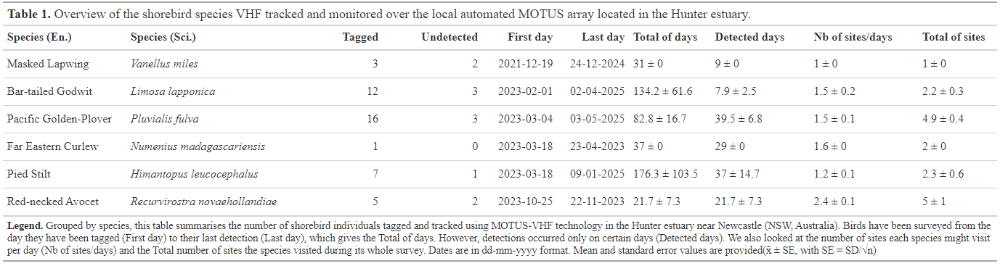
  </figure>
</div>

```{r 03 MONI trap details, message = FALSE, warning = FALSE, eval = FALSE, echo = FALSE}
DT::datatable(
  MONI,
  options = list(
    scrollX = TRUE,
    pageLength = 10,
    fixedColumns = list(leftColumns = 2)
  ),
  extensions = c('FixedColumns'),
  caption = 'Table 2: Complete details on shorebird captures'
) %>%
  DT::formatStyle(
    c('Band.ID', 'motusTagID'),
    fontWeight = 'bold'
  ) %>%
  DT::formatStyle(
    c('DateAUS.Trap', 'Location'),
    fontWeight = 'bold',
    color = '#808080'  
  )


-   `nb_tagged`: total of birds trapped, banded (`Band.ID`) and tagged with a MOTUS device (`motusTagID`)
-   `nb_euthanised`: total of birds that has been euthanised
-   `nb_retagged`: total of birds that were re-trapped and needed to be re-tagged with a new MOTUS device, but did not require re-banding (as bands are permanent, whereas MOTUS devices can detach or fall off). This means that a single individual may have carried multiple MOTUS devices over time but only ever received one band
-   `nb_released`: total of unique individual birds that have been trapped at least once, banded, tagged with a MOTUS device, and subsequently released. These individuals constitute the population that is potentially detectable across our MOTUS receiver array
-   `detect_0`: total of individual that have NEVER been recorded across our MOTUS array (0 detection)
-   `detect_inf_150`: total of individual recorded LESS than 150 times across our MOTUS array
-   `detect_sup_150`: total of individual recorded MORE than 150 times across our MOTUS array

```

### Trapping: details {#details}

Find below more information about the captures (i.e. species, marking, banding, date, etc.).

```{r 03 spreadsheet trap details, message = FALSE, warning = FALSE, eval = TRUE, echo = FALSE}
DT::datatable(
  spreadsheet,
  options = list(
    scrollX = TRUE,
    pageLength = 10,
    fixedColumns = list(leftColumns = 2)
  ),
  extensions = c('FixedColumns'),
  caption = 'Table 3: Complete details on shorebird captures'
) %>%
  DT::formatStyle(
    c('Band.ID', 'motusTagID'),
    fontWeight = 'bold'
  ) %>%
  DT::formatStyle(
    c('DateAUS.Trap', 'Location'),
    fontWeight = 'bold',
    color = '#808080'  
  )
```

### Detected birds {#detected}

```{r 03 detect, message = FALSE, warning = FALSE, eval = TRUE, echo = FALSE}
DT::datatable(
  detect,
  options = list(
    scrollX = TRUE,
    pageLength = 10,
    fixedColumns = list(leftColumns = 3)
  ),
  extensions = c('FixedColumns'),
  caption = 'Table 4: Details on detected birds'
) %>%
  DT::formatStyle(
    c('Band.ID', 'motusTagID'),
    fontWeight = 'bold'
  ) %>%
  DT::formatStyle(
    c('Detections', 'DateAUS.Trap', 'Location'),
    fontWeight = 'bold',
    color = '#808080'  
  )
```

### Undetected birds {#undetected}

However, for various reasons — such as limitations in device technology, the bird never flying within the coverage area of any antenna, the device detaching, and so on — some birds have never been detected again after the day they were tagged.

```{r 03 undet, message = FALSE, warning = FALSE, eval = TRUE, echo = FALSE}
DT::datatable(
  undetect,
  options = list(
    scrollX = TRUE,
    pageLength = 10,
    fixedColumns = list(leftColumns = 2)
  ),
  extensions = c('FixedColumns'),
  caption = 'Table 5: Details on birds never detected'
) %>%
  DT::formatStyle(
    c('Band.ID', 'motusTagID'),
    fontWeight = 'bold'
  ) %>%
  DT::formatStyle(
    c('Species', 'DateAUS.Trap'),
    fontWeight = 'bold',
    color = '#808080'  
  )
```

### Euthanasied birds {#euthanasied}

Unfortunately, it happens that we need to euthanasy birds, under the ACCE of University of Newcastle.

```{r 03 euthe, message = FALSE, warning = FALSE, eval = TRUE, echo = FALSE}
DT::datatable(
  eutha,
  options = list(
    scrollX = TRUE,
    pageLength = 10,
    fixedColumns = list(leftColumns = 2)
  ),
  extensions = c('FixedColumns'),
  caption = 'Table 6: Details on euthanised birds'
) %>%
  DT::formatStyle(
    c('Band.ID', 'motusTagID'),
    fontWeight = 'bold'
  ) %>%
  DT::formatStyle(
    c('Species', 'DateAUS.Trap'),
    fontWeight = 'bold',
    color = '#808080'  
  )
```

<button
  class="backBtn"
  data-target="contents03" 
  onclick="document.getElementById(this.getAttribute('data-target')).scrollIntoView({behavior: 'smooth'});"
  style="position: fixed; bottom: 20px; right: 20px; z-index: 9999; padding: 10px 15px; background-color: #007bff; border: none; border-radius: 5px; color: white; cursor: pointer; box-shadow: 0 2px 4px rgba(0,0,0,0.3); display: none;">
  Back to Contents
</button>
:::

# [Method]{.smallcaps}

The following aims to describe the analysis ran with VHF Motus data set that tries to access the complex articulation of habitat selection from migratory shorebirds across and within estuaries habitats. The analysis process several key points before to properly studying migratory shorebirds spatial ecology as described as below:

1.  **Filtering the data**

<p style="font-size: 0.9em; color: gray;">

*Aims to clean out, simplify and format the raw data set from Motus network (.sql) to an easier table (.rds). Correct wrong data and NA, remove false positive signals, clarify ambiguous detection and add useful variables (ie. tide cycle, circadian cycle, etc.).*

</p>

2.  **Relative site usage**

<p style="font-size: 0.9em; color: gray;">

*The local deployed Motus array consists of 8 receivers that are supposed to listen to tag signals 24/7, which are emitted by devices attached to birds potentially within their reception range. However, not all receivers listen for the same amount of time due to various reasons (e.g., network installation dates, temporary outages, etc.). As a result, temporal coverage varies across receivers, meaning the survey effort—continuous 24/7 listening—is unequal among stations. Because of this, bird detection quality is not directly comparable between stations. This chapter addresses this bias by proposing the use of each site’s effort relative to bird detections, adjusting for differences in station survey effort.*

</p>

3.  **Motus array suitability**

<p style="font-size: 0.9em; color: gray;">

*All the bird species we are focusing on do not share the same land-use habitats. This means the built-up array cannot be equally suitable for every species since the receivers are permanently installed at specific sites throughout the estuaries. Among all the deployed tags, which ones have been best surveyed within the local Motus array?*

</p>

4.  **Habitat selection**

<p style="font-size: 0.9em; color: gray;">

*Descriptive & inferential analysis are conducted.* *First is visually compared the spatial occupancy from birds and over our Motus array depending two main factors: tide and circadian cycles.*

</p>

5.  **Shorebirds behaviour**

<p style="font-size: 0.9em; color: gray;">

*Using the variance of signal strength across bird detections at our Motus array scale, we can use it as a proxy to access animal behaviour with low variance in signal strength as low activity (i.e. roosting) and high variance of signal strength as high activity (i.e. foraging)*

</p>

::: blockquote-blue
Navigate the four different tabs below to get deeper into the [method]{.smallcaps} used.
:::

:::::: panel-tabset
## Close tabs

## 1. Filtering the data

### [Contents]{#contents1 style="color: grey; font-size: smaller;"}

-   [Packages](#packages)
-   [Download the data from Motus network](#download-the-data-from-motus-network)
-   [Filter the data](#filter-the-data)
-   [Adding variables](#adding-variables)
-   [Set survey time frame](#set-timeframe)
-   [Import Band ID](#bandID)
-   [Filtered data: overview](#overview)

---

### Packages {#packages}

```{r 1 packages, message = FALSE, warning = FALSE, eval = TRUE, echo = TRUE}

# install.packages("motus", 
#                  repos = c(birdscanada = 'https://birdscanada.r-universe.dev',
#                            CRAN = 'https://cloud.r-project.org'))
library(motus)
library(dplyr)
library(here)
library(DBI)
library(RSQLite)
library(forcats) 
library(lubridate)
library(bioRad) 
library(purrr) 
```

### Download the data from Motus network {#download-the-data-from-motus-network}

```{r 1 settings, message = FALSE, warning = FALSE, eval = FALSE, echo = TRUE}

# Global settings
setwd(dirname(rstudioapi::getSourceEditorContext()$path)) 
Sys.setenv(TZ="UTC") 
proj.num <- 294  
motusLogout()
```

Set general settings first as working directory, Time Zone, Motus project number (ie. ours is 294). And make sure the environment is free from any connection to any other networked project or from any other Motus user account (avoid undesired mistakes).

```{r 1 download data, message = FALSE, warning = FALSE, eval = FALSE, echo = TRUE}
sql.motus <- tagme(projRecv = proj.num,
                   new = FALSE, # TRUE overwrites existing (large data takes a while) FALSE used to update existing file
                   update = TRUE,
                   dir = here("data"))

metadata(sql.motus, proj.num)

sql.motus <- dbConnect(SQLite(), here::here("data", "project-294.motus"))

df.alltags <- tbl(sql.motus, "alltags") %>%
  dplyr::collect() %>%
  as.data.frame() %>%
    mutate(time = as_datetime(ts),
         timeAus = as_datetime(ts, tz = "Australia/Sydney"),
         dateAus = as_date(timeAus),
         year = year(time), 
         doy = yday(time))
```

`motus::tagme()`gets the data from the online Motus network, the ones part of your project (ie. ID = 294) only. Make sure you set your own directory. A file of type .sql is automatically created.

`motus::metadata()` downloads the metadata from the online Motus network (receiver information and more).

`motus::dbConnect()` links your .sql to your environment. Avoid to use high memory as .sql is a *lazy* table and not yet hardly written on your hardware.

`motus::tbl()` extracts all the tags fat into your environment. Then formatted into a classic dataframe.

### Filter the data {#filter-the-data}

::: blockquote-red
**WARNING**: The values entered within the below filtering R code are depending your own context.
:::

```{r 1 filter the data, message = FALSE, warning = FALSE, eval = FALSE, echo = TRUE}
# Cleaning and correcting tags metadata
df.alltags <- df.alltags %>% 
   filter(
    # test tags
     motusTagID != c("43291"),
    # pending, unconfirmed or undeployed tags
    !motusTagID %in% c("43288", "43291", "43297", "43299",
                       "43307", "43424", "43425", "60470", 
                       "60579", "81123", "81136", "81137"),
    # used for test/validation before tagging bird (remove time before the tagging)
    !(motusTagID == "81134" & time < dmy("23-11-2024")),
    !(motusTagID == "60575" & time < dmy("25-10-2023")) ) %>% 
    # NA species
     mutate(speciesEN = case_when(
       is.na(speciesEN) & motusTagID %in% c("60470", "81121") ~ "Red-necked Avocet",
       is.na(speciesEN) & motusTagID %in% c("81118") ~ "Red-necked Avocet",
       TRUE ~ speciesEN))
  
# Cleaning and correcting receiver metadata
df.alltags <- df.alltags %>% 
  filter(
    # NA
     !is.na(recvDeployLat),
    # site not any longer used
      recvDeployName != c("Throsby Creek Test Site"),
    # test sensor gnome
      recv != c("SG-C621RPI3E17F",       
                "SG-62A5RPI36710") ) %>% 
  mutate(recvDeployName = ifelse(is.na(recvDeployName) & recv == "SG-D5BBRPI3E2F7", "Windeyers", recvDeployName))
```

Here are cleaned-out the data recorded from undesired tags and/or receivers depending our local context.

Have been removed: test tags, tags recorded into the Motus project but undeployed, period of time where tags were *ON* but not set on any bird, test sensor gnome, sites not any longer used. Receiver station's name has been changed from *NA* to Windeyers starting from 02/15/2025. Tag's *specieEN* information have been changed from *NA* to different values depending case to case.

```{r 2 filter the noise, message = FALSE, warning = FALSE, eval = FALSE, echo = TRUE}
# False positive
df.alltags <- df.alltags %>% 
  filter(motusFilter == 1, # 0 is invalid data
         runLen >= 3) # value to be further thought

# Ambiguous 
clarify(sql.motus)
```

Then the False Positive signals are put away (ie. noise coming from external device, or any kind of external radio activity happening within the area) thanks to pre-made Motus filter and \`runLen\`. 
Motus Filter threshold values is set at 1, based on documentation and our data (see below).
Run Lengh threshold value is set at 3 and defines the number of bursts recorded from one tag and received at once, too low amount of burst are suspected for not being True Positif so not reliable.  

<div style="display: flex; flex-direction: column; align-items: center; justify-content: center; min-height: 60vh;">
  <figure>
    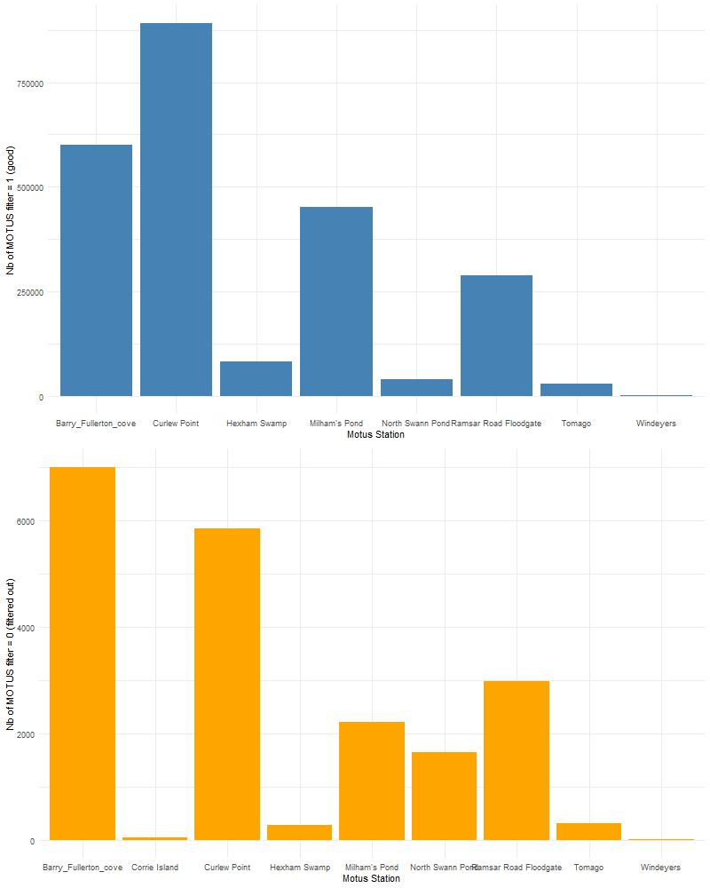
    <figcaption style="text-align: center; margin-top: 0.5em;">
    Figure 0: Number of detections defined by 1 or 0 from MOTUS filter across stations in the Hunter
    </figcaption>
  </figure>
</div>  

<div style="display: flex; flex-direction: column; align-items: center; justify-content: center; min-height: 60vh;">
  <figure>
    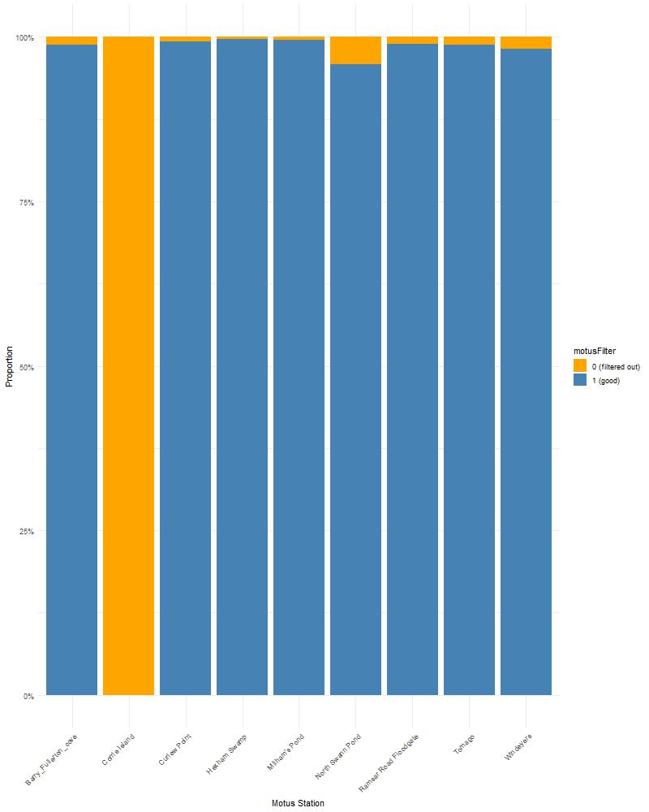
    <figcaption style="text-align: center; margin-top: 0.5em;">
    Figure 00: Percentage of detections defined by 1 or 0 from MOTUS filter across stations in the Hunter
    </figcaption>
  </figure>
</div>

`motus::clarify()` checks whether the combination of two tag signals emitting at the mean time could generate the detection of a third tag signal, which would be a False Positive on its own, but also hidding the two True Positives. If the table generated by this code has rows resulting, please go to [Motus documentation](https://motuswts.github.io/motus/articles/05-data-cleaning.html).

### Adding variables {#adding-variables}

```{r 1 Tide data, message = FALSE, warning = FALSE, eval = FALSE, echo = TRUE}
# Load tide (Callum work 01_import_tide_data.R)
tidalCurve <- readRDS(here::here("1_data", "tides", "tidalCurve.rds"))
tideData <- readRDS(here::here("1_data", "tides", "tideData.rds"))
tidalCurveFunc <- splinefun(tideData$tideDateTimeAus, tideData$tideHeight, method = "natural")
get.tideIndex <- function(time){ return(which.min(abs(tideData$tideDateTimeAus-time)))}
```

Note that the raw Tide data-set is not provided here. Since it has been manually extracted from [New South Wales government resources](https://www.nsw.gov.au/sites/default/files/2024-06/tide-tables-24-25-nsw.pdf) and formatted by [Callum Gapes](https://www.linkedin.com/in/callum-g/?originalSubdomain=au) through this [method](https://uoneduau-my.sharepoint.com/:u:/g/personal/c3541851_uon_edu_au/EWOk05RFs1xJhAWLBddbf-kB_H2xRuz0XPUWtPVfcju_-Q?e=P6WzOT).

```{r 1 variable, message = FALSE, warning = FALSE, eval = FALSE, echo = TRUE}
df.alltags <- df.alltags %>% 
  
# Sunrise/set
  sunRiseSet(lat = "recvDeployLat", 
             lon = "recvDeployLon", 
             ts = "ts") %>% 
  mutate(sunriseNewc = sunrise(dateAus, 151.7833, -32.9167, elev = -0.268, tz = "Australia/Sydney", force_tz = TRUE),
         sunsetNewc = sunset(dateAus, 151.7833, -32.9167, elev = -0.268, tz = "Australia/Sydney", force_tz = TRUE)) %>%
  
# Positive signal strength (min. = 0) for plotting
  mutate(sigPositive = sig + abs(min(sig))) %>%
  
# As Factor
  mutate(motusTagID = as.factor(motusTagID))

# Tide
df.alltags <- df.alltags %>% 
  mutate(tideHeight = tidalCurveFunc(timeAus),
         tideIndex = map_dbl(timeAus, get.tideIndex))

tide_values <- tideData[df.alltags$tideIndex, 
                        c("tideDateTimeAus",
                          "high_low",
                          "day_night",
                          "tideCategory",
                          "tideID",
                          "tideHeight")]

df.alltags <- df.alltags %>%
  mutate(tideDateTimeAus = tide_values$tideDateTimeAus,
         tideHighLow = as_factor(tide_values$high_low),
         tideDiel = as_factor(tide_values$day_night),
         tideCategory = as_factor(tide_values$tideCategory),
         tideCategoryHeight = tide_values$tideHeight,
         tideID = as_factor(tide_values$tideID),
         tideTimeDiff = abs(difftime(timeAus, tideDateTimeAus, units = "hours")) ) # Time diff btw detect. & nearest tide pts

```

Several variables are added as some are formatted and/or renamed for the aims of the study.

```{r 1 recv, message = FALSE, warning = FALSE, eval = FALSE, echo = TRUE}
# Get summary
df.recvDeps <- tbl(sql.motus, "recvDeps") %>% 
  collect() %>% 
  as.data.frame() %>%
    mutate(timeStart = as_datetime(tsStart),
         timeStartAus = as_datetime(tsStart, tz = "Australia/Sydney"),
         timeEnd = as_datetime(tsEnd),
         timeEndAus = as_datetime(tsEnd, tz = "Australia/Sydney"))

# Rename stations across alltags & receiver data-sets
station_rename <- list(
   "Barry_Fullerton_cove"  = "Fullerton Entrance",
   "North Swann Pond"      = "Swan Pond" ,
   "Ramsar Road Floodgate" = "Ramsar Road",
   "Milham's Pond"         = "Milhams Pond")
df.recvDeps <- df.recvDeps %>% 
  mutate(name = recode(name, !!!station_rename)) %>%
  rename(recvDeployName = "name")

df.alltags <- df.alltags %>% 
  mutate(recvDeployName = recode(recvDeployName,
                                 !!!station_rename))
  
# Filter not used stations as out of the local array
df.recvDeps <- df.recvDeps %>% 
     filter(!is.na(recvDeployLat),
          recvDeployName != c("Throsby Creek Test Site"),
          recv != c("SG-C621RPI3E17F",       # test station
                    "SG-62A5RPI36710") )     # test station

```

Rename here the receiver of your array for a better comprehension. Also, remove the stations that are not any longer used.

### Set survey time frame {#set-timeframe}

```{r 1 final filtering, message = FALSE, warning = FALSE, eval = FALSE, echo = TRUE}
df.recvDeps <- df.recvDeps %>%
  filter(timeStartAus > "2023-01-31 00:00:00 AEDT") 
```

Finally, set the *survey effort* starting day from our local Motus array, as one month before the first day a bird has been caught and tagged (information found into the [sharepoint](https://uonstaff.sharepoint.com/:x:/r/sites/StudentGroupPhD-LouiseWilliamsandMatteaTaylor/_layouts/15/Doc2.aspx?action=edit&sourcedoc=%7Ba23e66f0-c551-4ba4-acd0-de0d5e83ca42%7D&wdOrigin=TEAMS-MAGLEV.teamsSdk_ns.rwc&wdExp=TEAMS-TREATMENT&wdhostclicktime=175385) to access the file.).

### Import Band ID {#bandID}

As we might re-trap individuals and re-tag them with a new MOTUS tag, we can't use the Motus tag ID as unique ID anymore and have to use Band ID which supposes to last on the same bird from banding date to individual's death. Unfortunately, the Band ID is not imported by MOTUS network at the moment. So, we need to import it from our own record accessible on SharePoint [here](https://uonstaff.sharepoint.com/:x:/r/sites/StudentGroupPhD-LouiseWilliamsandMatteaTaylor/Shared%20Documents/General/SHOREBIRD%20NUMBER%20TRACKING.xlsx?d=wa23e66f0c5514ba4acd0de0d5e83ca42&csf=1&web=1&e=BuGI0w&nav=MTVfe0QyREY1NzZGLUM2RjktNEJFRi1BQThGLTc1M0E3OEFFM0ZERn0).

::: blockquote-yellow
**Note:** To download the spreadsheet from *Teams* to your device, you first need to *sync* the *Teams* cloud folder to your *OneDrive* account. Once synced, you can access it locally from your device and direct *RStudio* to work with this now-local directory. Refer to the instructions [here](https://support.microsoft.com/en-au/office/sync-sharepoint-and-teams-files-with-your-computer-6de9ede8-5b6e-4503-80b2-6190f3354a88) for more details.  
Remember to specify the correct directories in your *R* *code.*
:::

```{r 1 Band ID, message = FALSE, warning = FALSE, eval = FALSE, echo = TRUE}

# Call and extract last up to date Spreadsheet record (sync your one drive with the TEAMS channel first)
write.csv(readxl::read_excel("C:/Users/marin/The University of Newcastle/StudentGroupPhD - Louise Williams and Mattea Taylor - General/SHOREBIRD NUMBER TRACKING.xlsx"), # change the path depending your device
          file.path(here::here("1_data", "spreadsheets"), paste0(Sys.Date(), "-teams_sheet", ".csv")), 
          row.names = FALSE)

# Load df with date at the beginning
spreadsheet <- read.csv(here::here("1_data", "spreadsheets", paste0(Sys.Date(), "-teams.sheet.csv"))) %>%
  filter(Radio.tag. == "Y") %>%     # Keep only the tagged ones
  rename(DateAUS.Trap = "Date", motusTagID = "Motus.tag.ID") %>% 
  mutate(motusTagID = as.factor(motusTagID))

# Join unique Band IDs for inconsistent motusTag (same bird re-tagged, etc)
data_all <- left_join(data_all, 
                      spreadsheet %>% 
                        filter(is.na(Euthanised.)) %>%
                        select(motusTagID, DateAUS.Trap, Band.ID, Bander),
                      by = "motusTagID")
```


### Filtered data: overview {#overview}

```{r 1 data overview, message = FALSE, warning = FALSE, eval = FALSE, echo = TRUE}

# Band.IDs in spreadsheet but not in data_all (tagged + released but not detected)
nb_undetect <- spreadsheet %>% 
  filter(is.na(Euthanised.)) %>%
  distinct(Band.ID) %>%
  filter(!Band.ID %in% unique(data_all$Band.ID))

# Bird released (total tagged and released birds, supposed to be detectable) 
nb_release <- spreadsheet %>% 
  filter(is.na(Euthanised.),
         is.na(Retagged.))

# Combine all into Monitoring table table
moni <- bind_rows(
  # Nb of birds trapped & tagged
  tibble(variable = "nb_tagged",
         value  = length(spreadsheet$Band.ID)),
  # Nb of birds euthanised (tag re-used)
  tibble(variable = "nb_euthanised",
         value  = sum(spreadsheet$Euthanised. == "Y", na.rm = TRUE)),
  # Nb of birds re-trapped & re-tagged (initial tag lost)
  tibble(variable = "nb_retagged",
         value  = sum(!is.na(spreadsheet$Retagged.))),
  # Nb of birds trapped, tagged & released (supposed to be detectable)
  tibble(variable = "nb_released",
         value  = nrow(nb_release)),
  # Nb of birds released but never detected
  tibble(variable = "detect_0",
         value  = nrow(nb_undetect)),
  # Nb of birds released with low detection (less than 30 times)
  tibble(variable = "detect_inf_150",
         value  = data_all %>%
           count(Band.ID) %>%
           filter(n < 150) %>% #1*: we can change this treshold value depending our appreciation
           nrow() ),
  # Nb of birds released with good detection (more than 30 times)
  tibble(variable = "detect_sup_150",
         value  = data_all %>%
           count(Band.ID) %>%
           filter(n > 149) %>% #1*
           nrow() )
)

# Undetected & Euthanaised tables
undetect <-  spreadsheet %>% 
  filter(Band.ID %in% nb_undetect$Band.ID)
eutha <-  spreadsheet %>% 
  filter(Euthanised.== "Y")

```

```{r 1 data overview DOUBLE FOR GENERATING PLOT, message = FALSE, warning = FALSE, eval = TRUE, echo = FALSE}
DT::datatable(
  moni,
  options = list(
    scrollX = TRUE,
    pageLength = 10,
    fixedColumns = list(leftColumns = 2)
  ),
  extensions = c('FixedColumns'),
  caption = 'Overview on our bird data'
) %>%
  DT::formatStyle(
    'variable',
    fontWeight = 'bold'
  ) %>%
  DT::formatStyle(
    c('value'),
    fontWeight = 'bold',
    color = '#808080'  
  )

```

Let's have an overview on our data, now filtered and with every tagged bird identified with a unique *Band ID*, also related to a *MOTUS tag ID*.
Since 2021, we trapped `r moni$value[moni$variable == "nb_tagged"]` birds, and `r moni$value[moni$variable == "nb_released"]` were released and potentially detectable.

```{r 1 other cases, message = FALSE, warning = FALSE, eval = TRUE, echo = FALSE}
DT::datatable(
  undetect,
  options = list(
    scrollX = TRUE,
    pageLength = 10,
    fixedColumns = list(leftColumns = 2)
  ),
  extensions = c('FixedColumns'),
  caption = 'Birds never detected'
) %>%
  DT::formatStyle(
    c('Band.ID', 'motusTagID'),
    fontWeight = 'bold'
  ) %>%
  DT::formatStyle(
    c('Species', 'DateAUS.Trap'),
    fontWeight = 'bold',
    color = '#808080'  
  )

DT::datatable(
  eutha,
  options = list(
    scrollX = TRUE,
    pageLength = 10,
    fixedColumns = list(leftColumns = 2)
  ),
  extensions = c('FixedColumns'),
  caption = 'Birds euthanised'
) %>%
  DT::formatStyle(
    c('Band.ID', 'motusTagID'),
    fontWeight = 'bold'
  ) %>%
  DT::formatStyle(
    c('Species', 'DateAUS.Trap'),
    fontWeight = 'bold',
    color = '#808080'  
  )
```

Above are particular cases of undetected and euthanised individuals.

### Save

```{r 1 save .rds, message = FALSE, warning = FALSE, eval = FALSE, echo = TRUE}
saveRDS(df.alltags, here::here("data", paste0(Sys.Date(), "-data", ".rds" )))
saveRDS(df.recvDeps, here::here("data", paste0(Sys.Date(), "-recv-info", ".rds" )))
```

Save your now formatted data, ready for use. Automatically named with the date of your saving (for tracking updates).

<button
  class="backBtn"
  data-target="contents1" 
  onclick="document.getElementById(this.getAttribute('data-target')).scrollIntoView({behavior: 'smooth'});"
  style="position: fixed; bottom: 20px; right: 20px; z-index: 9999; padding: 10px 15px; background-color: #007bff; border: none; border-radius: 5px; color: white; cursor: pointer; box-shadow: 0 2px 4px rgba(0,0,0,0.3); display: none;">
  Back to Contents
</button>


## 2. Relative site usage

### [Contents]{#contents2 style="color: grey; font-size: smaller;"}

-   [Packages](#packages2)
-   [Load the data](#load-the-data2)
-   [Clarifying deviceID and stations](#clarifying2)
-   [Extracting listening periods per stations](#extracting2)
-   [MOTUS array survey effort](#survey-effort2)

---

### Packages {#packages2}

```{r 2 packages, message = FALSE, warning = FALSE, eval = TRUE, echo= TRUE}

library(motus)
library(dplyr)
library(here)
library(forcats) 
library(ggplot2)
library(lubridate)
library(tidyr)
library(purrr)

```

### Load the data {#load-the-data2}

Either call and load your own data by connecting through `DBI::dbConnect(RSQLite::SQLite())` and `tbl(sql.motus, "activity")`, or download the data up to the-last-document-update date provided here below (contact maxime.marini\@uon.edu.au for password access):

Receiver activity: <a href="#" onclick="return checkPassword('recv.act')">recv.act.rds</a><br>
Receiver information: <a href="#" onclick="return checkPassword('recv')">recv-info.rds</a><br> 
Bird data: <a href="#" onclick="return checkPassword('bird')">data.rds</a>

```{=html}
<script>
  function checkPassword(type) {
    var correctPasswords = {
      recv.act: "provence13",
    };
    var urlLinks = {
      recv.act: "https://uoneduau-my.sharepoint.com/:u:/g/personal/c3541851_uon_edu_au/EcizeHaA5kpHhluczVvJ5_4BoU4nfvFLtLGr0uTOPzsqng?e=FIF1gA",
      recv: "https://uoneduau-my.sharepoint.com/:u:/g/personal/c3541851_uon_edu_au/EemdZD3VJUdHvkVoKbqUhsABCJekUx7zYJ-_5snIw0BI4A?e=RRnDGy",
      bird: "https://uoneduau-my.sharepoint.com/:u:/g/personal/c3541851_uon_edu_au/EU1v7RPMqwZGi-fapl0G620BYQVUbAQcr1tHyDqgsEPBKg?e=pfZgDd"
    };
    var userPassword = prompt("Please enter the password to access the link:");
    if (userPassword === correctPasswords[type]) {
      window.open(urlLinks[type], '_blank');
    } else {
      alert("Incorrect password. Access denied.");
    }
    return false; // prevent default link behavior
  }
</script>
```

To properly load the data into your environment, make sure to set the working directory and the path as yours.

```{r 2 load data 1, eval = FALSE}
# Set WD
setwd(dirname(rstudioapi::getSourceEditorContext()$path)) 
# Birds
data_all <- readRDS(here::here("data", "recv.info.rds"))
# Receivers info
recv <- readRDS(here::here("data", "data.rds")) 
# Receiver activity
recv.act <- readRDS(here::here("data", "recv.act.rds")) 
```

```{r 2 load data 2, echo = FALSE, eval = TRUE}

# Birds
data_all <- readRDS(
  tail(sort(list.files(
    here::here("1_data", "alltags", "motus.rds"),
    pattern = "-data\\.rds$", full.names = TRUE
  )), 1)) 

# Receivers info
recv <- readRDS(
  tail(sort(list.files(
    here::here("1_data", "alltags", "motus.rds"),
    pattern = "-recv-info\\.rds$", full.names = TRUE
  )), 1)) 

# Receivers activity
sql.motus <- DBI::dbConnect(RSQLite::SQLite(), here::here("1_data", "alltags", "project-294.motus"))
recv.act <- tbl(sql.motus, "activity")  %>% 
  collect() %>% 
  as.data.frame() %>%
  rename(deviceID = "motusDeviceID") %>%
  filter(deviceID %in% unique(recv$deviceID)) %>% # keep our deployed antennas only 
  
  # Set the time properly - IMPORTANT
  mutate(date = as_datetime(as.POSIXct(hourBin* 3600, origin = "1970-01-06", tz = "UTC")),
         dateAus = as_datetime(as.POSIXct(hourBin* 3600, origin = "1970-01-06", tz = "UTC"), 
                             tz = "Australia/Sydney")) 

```

```{r 2 check the data,  message = FALSE, warning = FALSE, eval = TRUE}

head(recv.act)
table(is.na(recv.act$pulseCount), recv.act$numTags)  
table(is.na(recv.act$pulseCount) & is.na(recv.act$numTags))

```

`pulseCount`:Antenna pulses are a reflection of environmental noise and consist of radio pulses at the nominal listening frequency (e.g.; 166.38 MHz) which did not correspond to a known tag signature. The number of radio pulses measured on each antenna over each hour period (hourBin) - [`Motus documentation, 2025`](https://docs.motus.org/en/stations/station-inspection/up-time-and-detectability#antenna-pulses){target="_blank"} . `numTags`: Variable in the Motus SQL data (including the activity table and functions that generate site or tag summaries) represents the total number of unique tags detected within a given context—typically at a site, within a batch, or for a set of detections.

::: blockquote-yellow
**Note** that when `pulseCount` is NA, no noise has been recorded while one or several tags have been recorded. When no tag has been recorded but noise happened, `numTags` = 0 and `pulseCount` \> 0. So a case when a station is actually listening has either values or NA for `pulseCount` or/and for `numTags` variables. In other words, when a station is not listening, there is no row at all in the table (no data recorded).

**Keep in mind** What we can miss, are the hours where no tag or noise are happening within the environment BUT the antenna still being "listening". In such a case, let's further assume than the antenna is not working/listening since "no noise" condition during more than an hour may be extremely rare.
:::

### Clarifying deviceID and stations {#clarifying2}

One issue within the Motus data is the number of variables related to IDs (receivers, Raspberry Pi, sites, etc.) and the unconsistent names for the same variable across the different tables (ie. `recv$serno` = `alltags$recv`). Plus, some of our SensorGnome devices `serno` (black boxes containing a Raspberry Pi processor) have been swapped between sites to optimize the array survey. For example, when two stations need their devices repaired, we first remove the devices from their antennas to fix them. When re-installing, we prioritise placing the repaired device at the site where it is most needed, regardless of which station it originally came from.

Since the survey effort is accessed through the `hourBin` depending `deviceID` within the `activity` table, we need to re-associate each deviceID with their corresponding stations (`recvDeployName`) at the corresponding time/period. We'll first create a unique ID that matches station's name with `deviceID`: `SernoStation`.

```{r 2 clarifying stations,  message = FALSE, warning = FALSE, eval = TRUE}

# Sort the terminated serno (if terminated, ie. one box has been removed from one antenna site, and a date comes along recv$timeEndAus variable)
recv.act.term <- recv.act %>%
  left_join(recv %>% 
              filter(!is.na(timeEndAus)) %>%
              select(deviceID, serno, recvDeployName),
            "deviceID") %>%
  filter(!is.na(recvDeployName)) %>%
  mutate(SernoStation = paste0(recvDeployName, "_", serno))

# Sort the still currently running serno
recv.act.runn <- recv.act %>%
  left_join(recv %>% 
              filter(is.na(timeEndAus)) %>%
              select(deviceID, serno, recvDeployName),
            "deviceID") %>%
  filter(!is.na(recvDeployName)) %>%
  mutate(SernoStation = paste0(recvDeployName, "_", serno))

# Merging in one data-set to use Station's name further + pick-up the rounded hours
recv.act <- bind_rows(recv.act.runn, recv.act.term) %>%
  mutate(hour_dt = floor_date(dateAus, "hour"))

# Providing helpful variables
recv <- recv %>%
  mutate(SernoStation = paste0(recvDeployName, "_", serno),
         lisStart = timeStartAus,
         lisEnd = if_else(
           is.na(timeEndAus), # means the station is still running since the last data downloading
           with_tz(Sys.time(), "Australia/Sydney"),
           with_tz(as_datetime(timeEndAus, tz = "UTC"), "Australia/Sydney")) )

```

We get `recv.act` table with every rows of activity the variables `lisStart` and `lisEnd` that specify the complete period of time the station (`recvDeployName`) has been deployed with what `deviceID`. When a station is still deployed, `lisEnd` = NA.

### Extracting listening periods per stations {#extracting2}

```{r 2 Extracting listening periods,  message = FALSE, warning = FALSE, eval = TRUE}

# Generating hourly sequences per SernoStation from start to end dates of the deviceID at particular sites
recv_hours <- recv %>%
  select(recvDeployName, deviceID, SernoStation, lisStart, lisEnd) %>%
  rowwise() %>%
  mutate(hour_dt = list(seq(from = floor_date(lisStart, unit = "hour"),
                            to = floor_date(lisEnd, unit = "hour"),
                            by = "hour")) ) %>%
  unnest(cols = c(hour_dt)) %>%
  ungroup()

# Giving operational and not-operationnal hours by joining same sequences from recv.act tbl and adding operational = TRUE when existing values
recv_hours <- recv_hours %>%
  left_join(recv.act %>%
              distinct(SernoStation, hour_dt) %>%
              mutate(operational = TRUE),
            by = c("SernoStation", "hour_dt")) %>%
  mutate(operational = if_else(is.na(operational), FALSE, TRUE))

# Relaying on the Station name on its own only (consistent values through SernoStation var)
recv.act$Station <- sub("_SG-.*", "", recv.act$SernoStation)
recv$Station <- sub("_SG-.*", "", recv$SernoStation)
recv_hours$Station <- sub("_SG-.*", "", recv_hours$SernoStation)

```

Step where for each row of `recv` is created one list composed of as many rows of as many hours it is contained within the period \[`lisStart` - `lisEnd`\], and if `lisEnd` is NA because the station is still running, the date of today is taken. This prepares the `recv_hours` table where each row is one hour when one station (`SernoStation`) can potentially be working/listening. To get the `operational` hours for each stations, meaning "when a station is actually listening", we first gave an extra variable to the `recv.act` table as `operational` is always TRUE since this records only the hours when the station is listening, and we join this to the `recv` table by the shared variable `hour_dt`, which then will generate NA for the cases `recv_hours$hour_dt` has no matching values with `recv.act$hour_dt`. These NA are the hours where one site is deployed, but not working.

Finally, for consistency, we make sure that we are using station's name (`Station`) regardless the `deviceID`.

### MOTUS array survey effort {#survey-effort2}

- [Table: summary](#summary2)   
- [Plot: array survey effort per hour](#plot-hour2)   
- [Plot: array survey effort per day](#plot-day2)  
- [Plot: array survey effort per station](#plot-station2)

#### Table: summary {#summary2}

```{r 2 table MOTUS array survey effort,  message = FALSE, warning = FALSE, eval = TRUE}

uptime_summary <- recv_hours %>%
  group_by(Station) %>%
  summarise(
    total_hours = n(),
    operational_hours = sum(operational), 
    downtime_hours = total_hours - operational_hours, 
    uptime_pct = round(100 * operational_hours / total_hours), 2)  %>% 
  mutate(cont_listening_eff = round(100 * operational_hours / sum(operational_hours), 1), 
         surv_time_cover = round(100 * operational_hours / total_hours, 1)) %>%
  arrange(desc(uptime_pct))

```

```{r 2 table MOTUS array survey effort print,  message = FALSE, warning = FALSE, echo = FALSE}
DT::datatable(
  uptime_summary,
  options = list(
    scrollX = TRUE,
    pageLength = 10,
    fixedColumns = list(leftColumns = 2)
  ),
  extensions = c('FixedColumns'),
  caption = 'Summary of MOTUS array survey effort per station'
) %>%
  DT::formatStyle(
    'Station',
    fontWeight = 'bold'
  ) %>%
  DT::formatStyle(
    c('cont_listening_eff', 'surv_time_cover'),
    fontWeight = 'bold',
    color = '#808080'  
  )
```


Let's summarize the information regarding the survey effort from our MOTUS array:

-   `total_hours`: total of hours for the station being deployed into the field, regardless whether it is working/listening
-   `operational_hours`: total of hours for the station being listening, regardless the `deviceID`
-   `downtime_hours`: total of hours for the station being NOT listening, regardless the `deviceID`
-   `uptime_pct`: per station, percentage of being listening over its `total_hours`
-   `cont_listening_eff`: per station, contribution (%) of hours being listening (`operational_hour`) over the total (sum) of listening period across all the stations
-   `surv_time_cover`: per station, temporal coverage (%) of hours being listening (`operational_hour`) over the period of time the array has been deployed (i.e. from the first day the first deployed station has been listening to the last day the last deployed station has been listening)

::: blockquote-yellow
AWAITING FOR UPDATES: The data-set have some unknown and not-understood *NaN* within the raw data (failure in collecting process?). That matches pretty well with some gaps along the antennas survey effort (i.e. Hexham road), so, we expect to fill up these gaps once the *NaN* are processed.
:::


#### Plot: array survey effort per hour {#plot-hour2}

```{r 2 hour MOTUS array survey effort,  message = FALSE, warning = FALSE, eval = TRUE}

motus_survey_h <- ggplot(recv_hours %>% 
         filter(operational),
       aes(x = hour_dt, y = factor(Station))) +
  geom_segment(aes(
    x = hour_dt,
    xend = hour_dt + hours(1),
    y = Station,
    yend = Station
  ), color = "black", linewidth = 1) +
  scale_y_discrete(name = "Receiver Station") +
  scale_x_datetime(name = "Time") +
  theme_minimal() +
  ggtitle("Receiver Operational Periods per hours")

```

```{r 2 hour MOTUS array survey effort plot,  message = FALSE, warning = FALSE, echo = FALSE}
ggplot2::ggsave( here::here("docs", "figures", "motus_survey_h.jpeg"), motus_survey_h, 
                 width = 15, height = 6, dpi = 150)
```

[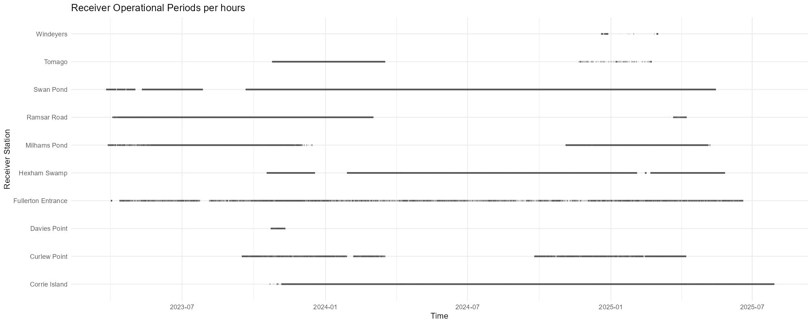{width=100%}](figures/motus_survey_h.jpeg){target="_blank"}


#### Plot: array survey effort per day {#plot-day2}

```{r 2 day MOTUS array survey effort,  message = FALSE, warning = FALSE, eval = TRUE, echo = FALSE}

# Plot (day detailed)
recv.status <- recv_hours %>%
  filter(operational) %>%
  arrange(Station, hour_dt) %>%
  group_by(Station) %>%
  # Calculate gap (in hours) between consecutive operational hours
  mutate(gap_hours = as.numeric(difftime(hour_dt, lag(hour_dt), units = "hours")),
         # New run starts if gap > 24h or if first row (NA gap)
         run_group = cumsum(if_else(is.na(gap_hours) | gap_hours > 24, 1, 0))) %>%
  group_by(Station, run_group) %>%
  # Get the start and end datetime per run group
  summarise(start_hour = min(hour_dt),
            end_hour = max(hour_dt) + hours(1), # +1 hour to cover full period
            .groups = "drop") %>%
  left_join(uptime_summary %>% select(Station, cont_listening_eff), "Station") %>%
  mutate(StationP = paste0(Station, " (", round(cont_listening_eff, digits = 1), "%)")) 

motus_survey_d <- ggplot(recv.status, aes(y = factor(StationP))) +
  geom_segment(aes(x = start_hour, xend = end_hour,
                   yend = factor(StationP)),
               color = "black", linewidth = 1) +
  
  scale_y_discrete(name = "") +
  scale_x_datetime(name = "Time",
                   date_breaks = "1 month",
                   date_labels = "%b",
                   sec.axis = dup_axis(breaks = seq(from = floor_date(min(recv.status$start_hour),
                                                                      "year") + months(3),
                                                    to = floor_date(max(recv.status$end_hour), 
                                                                    "year") + months(3),
                                                    by = "1 year"),
                                       labels = function(x) format(x, "%Y"),
                                       name = NULL)) +
  
  theme_minimal() +
  theme(axis.text.y.left = element_text(face = "bold", vjust = 0.5, margin = margin(t = 5)),
        axis.text.x.top = element_text(face = "bold", vjust = 0.5, margin = margin(t = 5)),
        axis.text.x = element_text(size = 9)) +
  ggtitle("Receiver Operational Periods per days (contribution % at the survey effort - listening)")

# Adding Birds 
data_all_plot <- left_join(data_all %>%
                             select(Band.ID, recv, recvDeployName, timeAus, tideCategory, speciesEN),
                           recv.status %>% 
                             rename(recvDeployName = Station) %>%
                             select(recvDeployName, StationP) %>%
                             unique(), 
                           "recvDeployName")

species_colors <- c(
  "Bar-tailed Godwit"      = "#1b9e77",  
  "Far Eastern Curlew"     = "#d95f02",  
  "Masked Lapwing"         = "#7570b3", 
  "Pacific Golden-Plover"  = "#e7298a", 
  "Pied Stilt"             = "#66a61e", 
  "Red-necked Avocet"      = "#e6ab02"   
)

motus_survey_d <- motus_survey_d +
  geom_point(
    data = data_all_plot ,
    aes(x = timeAus,
        y = factor(StationP), 
        color = speciesEN),
    alpha = 0.7, size = 2) +
  scale_color_manual(name = "Species", values = species_colors)

```

```{r 2 day MOTUS array survey effort plot,  message = FALSE, warning = FALSE, echo = FALSE}
ggplot2::ggsave( here::here("docs", "figures", "motus_survey_d.jpeg"), motus_survey_d, 
                 width = 15, height = 6, dpi = 150)
```

[![Legend: Solid black lines are when a MOTUS station is operational For simplifying, When a station is not operational for less than 24 hours, this period is considered as a operational period. Every dot represent at least one detection of one bird within an hour of the operational period. Every MOTUS station has a contribution value at the survey effort (%), i.e: Curlew Point station contributed 11.2% at the total operational period for every stations within our local MOTUS array (operational survey effort).](figures/motus_survey_d.jpeg){width=100%}](figures/motus_survey_d.jpeg){target="_blank"}
 

#### Plot: array survey effort per station {#plot-station2}

::: panel-tabset

```{r 2 station MOTUS array survey effort plot, echo = FALSE, eval = TRUE, results = 'asis'}

# Split the detection data by StationP
data_split <- split(data_all_plot, data_all_plot$StationP)

# Make sure your recv.status also has start/end per StationP
recv_split <- split(recv.status, recv.status$StationP)

# Create a named list of plots, one per station
plots_per_station <- imap(data_split, ~ {
  station_data <- .x
  station_name <- .y
  effort_data <- recv_split[[station_name]]
  
tag_order <- station_data %>%
    distinct(Band.ID, speciesEN) %>%
    arrange(speciesEN, Band.ID) %>%
    pull(Band.ID)
  
# Create a factor with levels ordered by speciesEN grouping
station_data <- station_data %>%
    mutate(Band.ID_ordered = factor(Band.ID, levels = tag_order))

ggplot() +
  # Vertical bands for survey effort periods
  geom_rect(data = effort_data, 
            aes(xmin = start_hour, xmax = end_hour, ymin = -Inf, ymax = Inf),
            fill = "grey80", alpha = 0.3) +
  
    # Points for detections with ordered Band.ID
    geom_point(data = station_data,
               aes(x = timeAus,
                   y = Band.ID_ordered,
                   color = speciesEN),
               alpha = 0.7, linewidth = 2) +
    scale_color_manual(
      values = species_colors,
      name = paste0("Species\n (n = ", n_distinct(station_data$Band.ID_ordered), " indiv. recorded)") ) +
    scale_y_discrete() +
    theme_bw() +
    labs(title = station_name,
         x = "Time (Aus)",
         y = "Band.ID") +
    theme(axis.text.y = element_text(size = 6),
          plot.title = element_text(hjust = 0.5))
})

# Now you can print each plot in your Quarto chunk by looping over the list
  for (station_data in names(plots_per_station)) {
    cat("\n\n## ", station_data, "\n\n") 
    print(plots_per_station[[station_data]]) 
    flush.console() #force immediate output
  }

```

:::

***Legend:*** *The band in grey represents the operational period for each MOTUS station, when the antenna is actually listening. When no grey, the station is "OFF" and not operational. Every dot is at least one detection for one tag. Every MOTUS station has a contribution value at the survey effort (%), i.e: Curlew Point station contributed 11.2% at the total operational period for every stations within our local MOTUS array (operational survey effort).*

<button
  class="backBtn"
  data-target="contents2" 
  onclick="document.getElementById(this.getAttribute('data-target')).scrollIntoView({behavior: 'smooth'});"
  style="position: fixed; bottom: 20px; right: 20px; z-index: 9999; padding: 10px 15px; background-color: #007bff; border: none; border-radius: 5px; color: white; cursor: pointer; box-shadow: 0 2px 4px rgba(0,0,0,0.3); display: none;">
  Back to Contents
</button>


## 3. Motus array suitability

### [Contents]{#contents3 style="color: grey; font-size: smaller;"}

-   [Packages](#packages3)
-   [Load the data](#load-the-data3)
-   [Process variables](#process3)
-   [Detectectability: Tables](#tables3)
-   [Detectability: Plots](#plots3)

---

### Packages {#package3}

```{r 3 packages, message = FALSE, warning = FALSE, eval = TRUE, echo= TRUE}
library(dplyr)
library(here)
library(ggplot2)
library(lubridate)
library(tidyr)
```

### Load the data {#load-the-data3}

Either load your own data generated across the previous chapters (.rds format), or download the data up to the-last-document-update date provided here below (contact maxime.marini\@uon.edu.au for password access):

Receiver information: <a href="#" onclick="return checkPassword('recv')">recv-info.rds</a><br>
Bird data: <a href="#" onclick="return checkPassword('bird')">data.rds</a>

```{=html}
<script>
  function checkPassword(type) {
    var correctPasswords = {
      recv: "provence13",
      bird: "provence13"
    };
    var urlLinks = {
      recv: "https://uoneduau-my.sharepoint.com/:u:/g/personal/c3541851_uon_edu_au/EemdZD3VJUdHvkVoKbqUhsABCJekUx7zYJ-_5snIw0BI4A?e=RRnDGy",
      bird: "https://uoneduau-my.sharepoint.com/:u:/g/personal/c3541851_uon_edu_au/EU1v7RPMqwZGi-fapl0G620BYQVUbAQcr1tHyDqgsEPBKg?e=pfZgDd"
    };
    var userPassword = prompt("Please enter the password to access the link:");
    if (userPassword === correctPasswords[type]) {
      window.open(urlLinks[type], '_blank');
    } else {
      alert("Incorrect password. Access denied.");
    }
    return false; // prevent default link behavior
  }
</script>
```

To properly load the data into your environment, make sure to set the working directory and the path as yours.

```{r 3 load data 1, eval = FALSE}
# Set WD
setwd(dirname(rstudioapi::getSourceEditorContext()$path)) 
# Birds
data_all <- readRDS(here::here("data", "recv.info.rds"))
```

```{r 3 load data 2, echo = FALSE, eval = TRUE}
# Birds
data_all <- readRDS(
  tail(sort(list.files(
  here::here("1_data", "alltags", "motus.rds"),
  pattern = "-data\\.rds$", full.names = TRUE
  )), 1)) # pick up the most recent .rds file
```

### Process variables  {#process3}

```{r 3 process, echo = TRUE, eval = TRUE}

# Get deployment duration for each tags (in days)
tag_dep_duration <- data_all %>%
  group_by(Band.ID) %>%
  summarise(start_date = min(DateAUS.Trap),
            end_date = max(dateAus),
            period_tag_dep_d = 1 + time_length(interval(start = start_date, end = end_date), unit = "day"), # +1 to include the trapping day
            .groups = "drop") %>%
  select(Band.ID, period_tag_dep_d)

# Get number days each tag has been detected at least once in any station
tag_dep_nb_d <- data_all %>%
  mutate(dateAus = as.Date(dateAus)) %>%
  group_by(Band.ID) %>%
  summarise(days_detect = n_distinct(dateAus), .groups = "drop")

# Get number of days one tag has been recorded in >1 station (for each tags)
multiple_site_detect <- data_all %>%
  group_by(Band.ID, dateAus) %>%
  # Counts per day the number of station one tag has been recorded
  summarise(distinct_sites = n_distinct(recvDeployName),
            .groups = "drop_last") %>%
  # Tells if one day one tag has been recorded several sites
  mutate(multiple_detect = distinct_sites > 1) %>%
  group_by(Band.ID) %>%
  summarise(multiple_site_detect = sum(multiple_detect),
            .groups = "drop")

```

### Detectectability: Tables  {#tables3}

```{r 3 table, echo = TRUE, eval = TRUE}
# Get number of day each tag has been recorded /species and /station
tag_detection <- data_all %>%
  group_by(Band.ID, recvDeployName, speciesEN) %>%
  # to count sp*ID per recv
  reframe(days_recorded = n_distinct(dateAus)) %>%
  # flip table to get one column per station
  pivot_wider(names_from = recvDeployName, 
              values_from = days_recorded,
              values_fill = 0) %>% # = 0 if NA
  left_join(multiple_site_detect, by = "Band.ID") %>%
  left_join(tag_dep_nb_d, by = "Band.ID") %>%
  left_join(tag_dep_duration, by = "Band.ID") %>%
  mutate(perc = round((days_detect / period_tag_dep_d) * 100, 1)) # nb of day one tag is recorded once / nb of day the tag is deployed

```

```{r 3 table bis, echo = TRUE, eval = TRUE}
DT::datatable(
  tag_detection,
  options = list(
    scrollX = TRUE,
    pageLength = 10,
    fixedColumns = list(leftColumns = 2)
  ),
  extensions = c('FixedColumns'),
  caption = 'MOTUS array detectability potential'
) %>%
  DT::formatStyle(
    c('Band.ID', 'perc'),
    fontWeight = 'bold'
  ) %>%
  DT::formatStyle(
    c('speciesEN', "multiple_site_detect", "days_detect", "period_tag_dep_d"),
    fontWeight = 'bold',
    color = '#808080'  
  )

```

-   `[MOTUS stations]`: total of days an individual has been detected across one MOTUS station
-   `multiple_site_detect`: total of days an individual has been detected at more than one MOTUS station
-   `days_detect`: total of days an individual has been recorded at least once across any MOTUS station
-   `period_tag_dep_d`: total period of Nanotag deployment on an individual (from trapping day to last detection)
-   `perc`: total of days the bird has been detected over its deployed tag period (`days_detect`/ `period_tag_dep_d`)

### Detectectability: Plots  {#plots3}

#### Per birds

```{r 3 plot birds, echo = TRUE, eval = TRUE}
ggplot(tag_detection %>%
         group_by(speciesEN) %>%
         arrange(desc(perc), .by_group = TRUE) %>%
         mutate(Band.ID = factor(Band.ID, levels = unique(Band.ID))), 
       aes(x = Band.ID, y = perc, fill = speciesEN)) +
  geom_col(width = 0.8, alpha = 0.7, color = "black") +
  scale_fill_manual(values = species_colors) +
  theme_minimal() +
  theme(axis.text.x = element_text(angle = 90, hjust = 1),
        legend.position = "bottom",
        legend.title = element_blank()) +
  labs(x = "Band ID",
       y = "Detection (%)",
       title = "Bird detection across MOTUS array (% of days)")
```

#### Per species

```{r 3 histogram sp, echo = TRUE, eval = TRUE}
ggplot(tag_detection %>%
         group_by(speciesEN) %>%
         summarise(n = n_distinct(Band.ID),            
                   mean_perc = mean(perc, na.rm = TRUE)) %>%
         mutate(species_label = paste0(speciesEN, " (n = ", n, ")")) %>%
         arrange(desc(mean_perc)) %>%
         mutate(species_label = factor(species_label, levels = species_label)), 
       
       aes(x = species_label, y = mean_perc, fill = speciesEN)) +  # fill mapped to speciesEN
  geom_col(width = 0.8, alpha = 0.7, color = "black") +
  scale_fill_manual(values = species_colors) +
  theme_minimal() +
  theme(axis.text.x = element_text(angle = 90, hjust = 1),
        legend.position = "none") +
  labs(x = "Species (n = indiv.)",
       y = "Detection (%)",
       title = "Species detectability across the MOTUS array (Histogram)")

```

```{r 3 boxplot sp, echo = TRUE, eval = TRUE}
ggplot(tag_detection %>%
         add_count(speciesEN) %>%
         mutate(species_label = paste0(speciesEN, " (n = ", n, ")")),
       aes(x = reorder(species_label, -perc, FUN = median),
           y = perc, fill = speciesEN)) +   
  geom_boxplot(width = 0.8, alpha = 0.7, color = "black") +
  scale_fill_manual(values = species_colors) +
  theme_minimal() +
  theme(axis.text.x = element_text(angle = 90, hjust = 1),
        legend.position = "none") +
  labs(x = "Species (number of individuals)",
       y = "Detection (%)",
       title = "Species detectability across the MOTUS array (Boxplot)")

```

<button
  class="backBtn"
  data-target="contents3" 
  onclick="document.getElementById(this.getAttribute('data-target')).scrollIntoView({behavior: 'smooth'});"
  style="position: fixed; bottom: 20px; right: 20px; z-index: 9999; padding: 10px 15px; background-color: #007bff; border: none; border-radius: 5px; color: white; cursor: pointer; box-shadow: 0 2px 4px rgba(0,0,0,0.3); display: none;">
  Back to Contents
</button>

## 4. Habitat selection

### Sections

- [Tide & circadian cycles](#tide-circadian-cycle4)
- [Available vs Used](#available-used)

::: blockquote-blue
Reminder: Using the term *habitat selection* report in fact to Motus receiver area coverage selection.
:::

### Tide & circadian cycles {#tide-circadian-cycle4}

#### [Contents]{#contents4 style="color: grey; font-size: smaller;"}

-   [Packages](#packages4)
-   [Load the data](#load-the-data4)
-   [Summarise the data](#summarise-the-data4)
-   [Descriptive analysis](#descriptive-analysis4)
-   [Results in barplots](#barplots4)


---

#### Packages {#packages4}

```{r 4 packages, message = FALSE, warning = FALSE, eval = TRUE, echo= TRUE}
library(motus)
library(dplyr)
library(here)
library(DBI)
library(RSQLite)
library(forcats) 
library(lubridate)
library(bioRad) 
library(purrr) 
library(sf)
library(lubridate)
library(rnaturalearth)
library(ggplot2)
```

#### Load the data {#load-the-data4}

Either load your own data generated across the previous chapters (.rds format), or download the data up to the-last-document-update date provided here below (contact maxime.marini\@uon.edu.au for password access):

Receiver information: <a href="#" onclick="return checkPassword('recv')">recv-info.rds</a><br>
Bird data: <a href="#" onclick="return checkPassword('bird')">data.rds</a>  
Tide data: <a href="TideDataNewcastle.csv" download>TideDataNewcastle.csv</a>

```{=html}
<script>
  function checkPassword(type) {
    var correctPasswords = {
      recv: "provence13",
      bird: "provence13"
    };
    var urlLinks = {
      recv: "https://uoneduau-my.sharepoint.com/:u:/g/personal/c3541851_uon_edu_au/EemdZD3VJUdHvkVoKbqUhsABCJekUx7zYJ-_5snIw0BI4A?e=RRnDGy",
      bird: "https://uoneduau-my.sharepoint.com/:u:/g/personal/c3541851_uon_edu_au/EU1v7RPMqwZGi-fapl0G620BYQVUbAQcr1tHyDqgsEPBKg?e=pfZgDd",
      tide: "https://uoneduau-my.sharepoint.com/:x:/g/personal/c3541851_uon_edu_au/EUgbWsuze1lPigfriI2Wn5QBf8bm15dwHl_vpRzsCh7yGw?e=TREcgs"
    };

    if (type === "tide") {
      window.open(urlLinks[type], "_blank");
      return false;
    }

    var userPassword = prompt("Please enter the password to access the link:");
    if (userPassword === correctPasswords[type]) {
      window.open(urlLinks[type], "_blank");
    } else {
      alert("Incorrect password. Access denied.");
    }
    return false;
  }
</script>
```

To properly load the data into your environment, make sure to set the working directory and the path as yours.

```{r 4 load data 1, eval = FALSE}
# Set WD
setwd(dirname(rstudioapi::getSourceEditorContext()$path)) 
# Birds
data_all <- readRDS(here::here("data", "recv.info.rds"))
# Receivers info
recv <- readRDS(here::here("data", "data.rds")) 
```

```{r 4 load data 2, echo = FALSE, eval = TRUE}

# Birds
data_all <- readRDS(
  tail(sort(list.files(
  here::here("1_data", "alltags", "motus.rds"),
  pattern = "-data\\.rds$", full.names = TRUE
  )), 1)) # pick up the most recent .rds file

# Receivers info
recv <- readRDS(
  tail(sort(list.files(
    here::here("1_data", "alltags", "motus.rds"),
    pattern = "-recv-info\\.rds$", full.names = TRUE
  )), 1)) 
```

#### Summarise the data {#summarise-the-data4}

For the aim of the analysis and generate readable figures, let's simplify the table to keep useful information only.

```{r 4 summarise data, echo = TRUE, eval = TRUE}
# Data summary (To be edited still...)
tagSummary1 <- data_all %>%
  group_by(Band.ID, recvDeployName) %>% 
  summarize(nDet = n(),
            nRecv = n_distinct(recvDeployName),
            timeMin = min(time),
            timeMax = max(time),
            totDay = length(unique(doy)), 
            species = first(speciesEN),
            .groups = "drop") %>%
  relocate(Band.ID, species)

tag_summary2 <- data_all %>%
  group_by(recvDeployName, tideCategory, speciesEN) %>%
  summarise(nTags = n_distinct(Band.ID), .groups = "drop")

# Selecting variables
data <- data_all %>%
  select(
    
  # Project ID
    recvProjID,
    tagProjID,
  # Tag
    Band.ID,
  # Time
    time,
    timeAus,
    year,
  # Receiver
    recv,
    recvDeployName,
  # Tide cycle
    tideHeight,
    tideCategory,
  # Circadian cycle
    sunriseNewc,
    sunsetNewc,
  # Signal strengh
    sigPositive,
  # Bird info
    speciesID, speciesEN, speciesFR, speciesSci,
    speciesGroup,
  # Comment
    tagDepComments
    )

species_colors <- c(
  "Bar-tailed Godwit"      = "#1b9e77",  
  "Far Eastern Curlew"     = "#d95f02",  
  "Masked Lapwing"         = "#7570b3", 
  "Pacific Golden-Plover"  = "#e7298a", 
  "Pied Stilt"             = "#66a61e", 
  "Red-necked Avocet"      = "#e6ab02"   
)
```


#### Results in barplots {#barplots4}

OVER THE MOTUS ARRAY

```{r 4 Habitat selection across sites, echo = TRUE, eval = TRUE}
    tag_summary2 %>%
      mutate(tideCategory  = case_when(
      tideCategory == "Nocturnal_High" ~ "NH",
      tideCategory == "Diurnal_Low"    ~ "DL",
      tideCategory == "Diurnal_High"   ~ "DH",
      tideCategory == "Nocturnal_Low"  ~ "NL",
      TRUE ~ tideCategory )) %>%
      ggplot(aes(x = as.factor(tideCategory), y = nTags, fill = speciesEN)) +
      geom_col(position = "stack") +   
      facet_wrap(~ recvDeployName) +   
      theme_bw() +
      labs(x = "Tide Category", y = "Number of individual detected", fill = "Species") +
      scale_fill_manual(values = species_colors)
```

OVER EACH MOTUS STATIONS

::: panel-tabset

```{r 4 Habitat selection across sites 2, echo = FALSE, eval = TRUE, results = 'asis'}
plots <- tag_summary2 %>%
      mutate(tideCategory  = case_when(
      tideCategory == "Nocturnal_High" ~ "NH",
      tideCategory == "Diurnal_Low"    ~ "DL",
      tideCategory == "Diurnal_High"   ~ "DH",
      tideCategory == "Nocturnal_Low"  ~ "NL",
      TRUE ~ tideCategory )) %>%
      split(.$recvDeployName) %>%
      purrr::map(~ ggplot(.x, aes(x = tideCategory, y = nTags, fill = speciesEN)) +
            geom_col(position = "stack") +
            facet_wrap(~ speciesEN) +
            scale_fill_manual(values = species_colors) +
            theme_bw() +
            labs(x = "Tide Category",
                 y = "Number of individuals detected",
                 fill = "Species"))
```

Table X?: Number of individuals detected at least once by a station part of the local MOTUS array.

```{r 4 Plot 2, echo = FALSE, eval = TRUE, results = 'asis'}
  for (recvDeployName in names(plots)) {
    cat("\n\n## ", recvDeployName, "\n\n") 
    print(plots[[recvDeployName]]) 
    flush.console() #force immediate output
  }
```
:::


<button
  class="backBtn"
  data-target="contents4" 
  onclick="document.getElementById(this.getAttribute('data-target')).scrollIntoView({behavior: 'smooth'});"
  style="position: fixed; bottom: 20px; right: 20px; z-index: 9999; padding: 10px 15px; background-color: #007bff; border: none; border-radius: 5px; color: white; cursor: pointer; box-shadow: 0 2px 4px rgba(0,0,0,0.3); display: none;">
  Back to Contents
</button>


### Available time vs Used {#available-used}

#### [Contents]{#contents4bis style="color: grey; font-size: smaller;"}

-   [Packages](#package4avsu)
-   [Load the data](#load-the-data4avsu)
-   [Process the data](#process4avsu)
-   [Results: Available vs Used](#results_avsu)
-   [Results: Used](#results_u)  
-   [Results: Time Used Rate](#time_used_rate)  


#### Packages {#package4avsu}

```{r 4 avsu packages, message = FALSE, warning = FALSE, eval = TRUE, echo= TRUE}
library(motus)
library(dplyr)
library(here)
library(forcats) 
library(ggplot2)
library(lubridate)
library(tidyr)
library(purrr)
library(readr)
library(bioRad)
library(hms)
library(dplyr)
library(ggplot2)
library(scales)
```

#### Load the data {#load-the-data4avsu}

Either load your own data generated across the previous chapters (.rds format), or download the data up to the-last-document-update date provided here below (contact maxime.marini\@uon.edu.au for password access):

Receiver information: <a href="#" onclick="return checkPassword('recv')">recv-info.rds</a><br>
Bird data: <a href="#" onclick="return checkPassword('bird')">data.rds</a>  
Tide data: <a href="TideDataNewcastle.csv" download>TideDataNewcastle.csv</a>

```{=html}
<script>
  function checkPassword(type) {
    var correctPasswords = {
      recv: "provence13",
      bird: "provence13"
    };
    var urlLinks = {
      recv: "https://uoneduau-my.sharepoint.com/:u:/g/personal/c3541851_uon_edu_au/EemdZD3VJUdHvkVoKbqUhsABCJekUx7zYJ-_5snIw0BI4A?e=RRnDGy",
      bird: "https://uoneduau-my.sharepoint.com/:u:/g/personal/c3541851_uon_edu_au/EU1v7RPMqwZGi-fapl0G620BYQVUbAQcr1tHyDqgsEPBKg?e=pfZgDd",
      tide: "https://uoneduau-my.sharepoint.com/:x:/g/personal/c3541851_uon_edu_au/EUgbWsuze1lPigfriI2Wn5QBf8bm15dwHl_vpRzsCh7yGw?e=3LcziQ"
    };

    if (type === "tide") {
      window.open(urlLinks[type], "_blank");
      return false;
    }

    var userPassword = prompt("Please enter the password to access the link:");
    if (userPassword === correctPasswords[type]) {
      window.open(urlLinks[type], "_blank");
    } else {
      alert("Incorrect password. Access denied.");
    }
    return false;
  }
</script>
```

To properly load the data into your environment, make sure to set the working directory and the path as yours.


```{r 4 avsu Load data available vs Used, message = FALSE, warning = FALSE, echo = FALSE, eval = TRUE, results = 'asis'}

# Birds
data_all <- readRDS(
  tail(sort(list.files(
    here::here("1_data", "alltags", "motus.rds"),
    pattern = "-data\\.rds$", full.names = TRUE
  )), 1)) 

# Tide
tide_data <- read_csv(here::here("1_data", "tides", "TideDataNewcastle.csv"))

# Receivers info
recv <- readRDS(
  tail(sort(list.files(
    here::here("1_data", "alltags", "motus.rds"),
    pattern = "-recv-info\\.rds$", full.names = TRUE
  )), 1)) 

# Receivers activity
sql.motus <- DBI::dbConnect(RSQLite::SQLite(), here::here("1_data", "alltags", "project-294.motus"))
recv.act <- tbl(sql.motus, "activity")  %>% 
  collect() %>% 
  as.data.frame() %>%
  rename(deviceID = "motusDeviceID") %>%
  filter(deviceID %in% unique(recv$deviceID)) %>% # keep our deployed antennas only 
  
  # Set the time properly - IMPORTANT
  mutate(date = as_datetime(as.POSIXct(hourBin* 3600, origin = "1970-01-06", tz = "UTC")),
         dateAus = as_datetime(as.POSIXct(hourBin* 3600, origin = "1970-01-06", tz = "UTC"), 
                               tz = "Australia/Sydney")) 


```

```{r 4 Load data available vs Used fake, message = FALSE, warning = FALSE, echo = TRUE, eval = FALSE, results = 'asis'}

# Birds
data_all <- readRDS(here::here("data.rds"))

# Tide
tide_data <- readr::read_csv(here::here("TideDataNewcastle.csv"))

# Receivers info
recv <- readRDS(here::here("data", "data.rds")) 

```


#### Process the data {#process4avsu}

To compare the time available in each category (high tide day, high tide night, low tide day, and low tide night) against the time shorebird species spend at each MOTUS station in our local array, we need to determine the available time for each species group at each MOTUS station. And we need to calculate the used for each bird at each MOTUS stations too.

*The below procedure breaks down how we accessed:*   
**- Tide variable (the four categories) **  
**- The time *available* **  
**- The time *used* **  

<div style="display: flex; flex-direction: column; align-items: center; justify-content: center; min-height: 60vh;">
  <figure>
    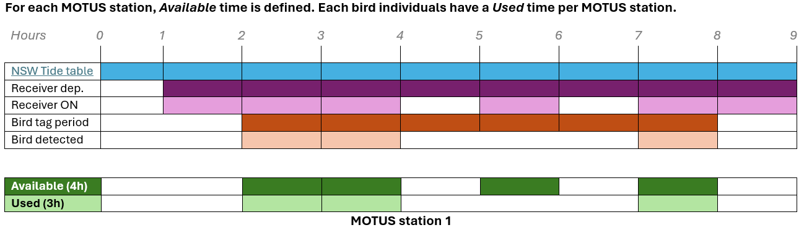
    <figcaption style="text-align: center; margin-top: 0.5em;">
      Schema 1: Definition of available and used periods across bird individuals and MOTUS stations
    </figcaption>
  </figure>
</div>
  
##### Tide variable

Based on [New South Wales Tide Tables](https://www.bom.gov.au/oceanography/projects/ntc/nsw_tide_tables.shtml) we were able to extract and classify the total time for each of the four categories of tide that occurred within the Hunter estuary. Note that one dataset is provided at the estuary scale, therefore, we assume the tide is occurring at the same scale, time, frequency and amplitude across our MOTUS station.

Tide table informs for Low and High tide peaks. Half of the period between peak *n* and peak *n-1* is taken, added to the period between peak *n* and peak *n+1*, then expanded in hours for further analysis. The tide associated to peak *n* defines its variable period (i.e. red lines below is defined as high tide since peak *n* is a high tide peak).  
  
<div style="display: flex; flex-direction: column; align-items: center; justify-content: center; min-height: 60vh;">
  <figure>
    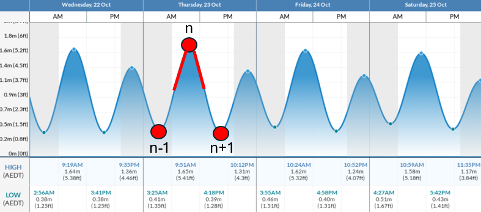
    <figcaption style="text-align: center; margin-top: 0.5em;">
    Schema 2: Definition of tide variables (high or low) for one period (red line)
    </figcaption>
  </figure>
</div>

```{r 4 Available vs Used TIDE, message = FALSE, warning = FALSE, echo = TRUE, eval = TRUE, results = 'asis'}

tide_data <- tide_data %>%
  arrange(tideDateTimeAus) %>%
  mutate(prev_time = lag(tideDateTimeAus),
         next_time = lead(tideDateTimeAus) ) %>%
  filter(!is.na(prev_time) & !is.na(next_time)) %>%
  mutate(duration_h = as.numeric(difftime(tideDateTimeAus, prev_time, units = "hours")/2 + 
                                    difftime(next_time, tideDateTimeAus, units = "hours")/2)) %>%
  
  mutate(sunriseNewc = sunrise(tideDateTimeAus, 151.7833, -32.9167, elev = -0.268, tz = "Australia/Sydney", force_tz = TRUE),
         sunsetNewc = sunset(tideDateTimeAus, 151.7833, -32.9167, elev = -0.268, tz = "Australia/Sydney", force_tz = TRUE),
         sunriseNewcTime = strftime(sunriseNewc, format = "%H:%M:%S", tz = "Australia/Sydney"),
         sunsetNewcTime = strftime(sunsetNewc, format = "%H:%M:%S", tz = "Australia/Sydney")) %>%
  
  mutate(tideDiel = case_when(tideDateTimeAus < sunriseNewc ~ "Nocturnal",
                               tideDateTimeAus > sunriseNewc & tideDateTimeAus < sunsetNewc ~ "Diurnal",
                               tideDateTimeAus > sunsetNewc ~ "Nocturnal")) %>%
  
  mutate(tideCategory = case_when(high_low == "Low" & tideDiel == "Diurnal" ~ "Diurnal_Low",
                                  high_low == "Low" & tideDiel == "Nocturnal" ~ "Nocturnal_Low",
                                  high_low == "High" & tideDiel == "Diurnal" ~ "Diurnal_High",
                                  high_low == "High" & tideDiel == "Nocturnal" ~ "Nocturnal_High") %>% 
           as_factor()) %>%
  rename(tideHighLow = high_low,
         timeAus = tideDateTimeAus) %>%
  select(timeAus, tideCategory, tideHighLow, tideDiel, duration_h, sunriseNewc, sunsetNewc)

data_bird <- data_all %>%
  mutate(burst_inter = ifelse(tagModel == "NTQB2-6-2", dseconds(7.1), dseconds(13.1))) %>%
  select(timeAus, tideCategory, tideHighLow, tideDiel, sunriseNewc, sunsetNewc, 
         speciesEN, tagModel, recvDeployName, recv,speciesSci, Band.ID, burst_inter)

```
  
  
##### Time *available*


Now tide data ready to be processed, we need to define for each individual (birds) and across each MOTUS stations, what was the amount of time available for the four tide categories.
  
  
Time of one MOTUS station (SG receiver) is reached by the use of activity table: each row is a record of noise or a tag with the datetime. We first need to extract the temporal coverage of each station, starting from deployment date to the last recorded activity datetime. And expand this period in hours.

```{r 4 Available vs Used RECV AVAILABLE, message = FALSE, warning = FALSE, echo = TRUE, eval = TRUE, results = 'asis'}

# Sort the terminated serno (if terminated, ie. one box removed from one antenna site, a date comes along)
# but still needed for accessing survey effort as the station is currently running with another serno 
recv.act.term <- recv.act %>%
  left_join(recv %>% 
              filter(!is.na(timeEndAus)) %>%
              select(deviceID, serno, recvDeployName),
            "deviceID") %>%
  filter(!is.na(recvDeployName)) %>%
  mutate(SernoStation = paste0(recvDeployName, "_", serno))

# Sort the currently running serno
recv.act.runn <- recv.act %>%
  left_join(recv %>% 
              filter(is.na(timeEndAus)) %>%
              select(deviceID, serno, recvDeployName),
            "deviceID") %>%
  filter(!is.na(recvDeployName)) %>%
  mutate(SernoStation = paste0(recvDeployName, "_", serno))

# Merging in one data-set to use Station's name further + pick-up the rounded hours
recv.act <- bind_rows(recv.act.runn, recv.act.term) %>%
  mutate(hour_dt = round_date(dateAus, "hour"))

# Providing helpful variables
recv <- recv %>%
  mutate(SernoStation = paste0(recvDeployName, "_", serno),
         lisStart = timeStartAus,
         lisEnd = if_else(
           is.na(timeEndAus), # means the station is still running since the last data downloading
           with_tz(Sys.time(), "Australia/Sydney"),
           with_tz(as_datetime(timeEndAus, tz = "UTC"), "Australia/Sydney")) )

# Generating hourly sequences per SernoStation from start to end dates of the deviceID at particular sites
recv_hours <- recv %>%
  select(recvDeployName, deviceID, SernoStation, lisStart, lisEnd) %>%
  group_by(SernoStation) %>%
  rowwise() %>%
  mutate(hour_dt = list(seq(from = round_date(lisStart, unit = "hour"),
                            to = round_date(lisEnd, unit = "hour"),
                            by = "hour")) ) %>%
  unnest(cols = c(hour_dt)) %>%
  ungroup()

# Simplify station variables (recvDeployName)
recv <- recv %>% 
  select(!recvDeployName) 
recv$recvDeployName <- sub("_SG-.*", "", recv$SernoStation)

recv_hours <- recv_hours %>% 
  select(!recvDeployName) 
recv_hours$recvDeployName <- sub("_SG-.*", "", recv_hours$SernoStation)

```

 
We now how the complete temporal coverage, expanded in hours, for each MOTUS station. However, due to some temporary failures or maintenance, the actual period where a MOTUS station is ON, meaning listening, may be different that the full temporal coverage. We need then to determine when a station was OFF and to substract these OFF periods to the complete temporal coverage.  
  
```{r 4 Available vs Used RECV OFF PERIODS, message = FALSE, warning = FALSE, echo = TRUE, eval = TRUE, results = 'asis'}  


# Distinguish station from mixed recv + Giving operational variable (= TRUE when existing values from act table)
recv_hours <- recv_hours %>%
  left_join(recv.act %>%
              distinct(recvDeployName, hour_dt) %>%
              mutate(operational = TRUE),
            by = c("recvDeployName", "hour_dt")) %>%
  mutate(operational = if_else(is.na(operational), FALSE, TRUE))

# /!\ Due to unknown error? Have to set this manually
recv_hours <- recv_hours %>%
  mutate(operational = case_when(
    recvDeployName == "Fullerton Entrance" & 
      hour_dt > as.POSIXct("2023-04-02") & 
      hour_dt < as.POSIXct("2023-04-05") ~ FALSE,
    TRUE ~ operational))

# Summary table                                                                     
off_runs <- recv_hours %>% 
  arrange(recvDeployName, hour_dt) %>%
  group_by(recvDeployName) %>%
  mutate(off_run_id = consecutive_id(operational == FALSE)) %>%
  ungroup() %>%
  
  filter(operational == FALSE) %>%
  
  group_by(recvDeployName, off_run_id) %>%
  summarise(
    start_off = min(hour_dt),
    end_off = max(hour_dt),
    tot_off_hours = n(),
    .groups = "drop") %>%
  
  filter(tot_off_hours > 24)

# Unique recvDeployNames from off_runs
recv_names <- unique(recv_hours$recvDeployName)

# Split tide_data into a named list with one element per recvDeployName
tide_data_list <- setNames(vector("list", length(recv_names)), recv_names)

for(name in recv_names) {
  # Get off intervals for this recvDeployName
  intervals <- off_runs %>%
    filter(recvDeployName == name) %>%
    select(start_off, end_off)
  
  # Get deployment start and end dates for this recvDeployName
  deploy <- recv_hours %>%
    filter(recvDeployName == name) %>%
    summarise(
      lisStart = min(lisStart, na.rm = TRUE),
      lisEnd = max(lisEnd, na.rm = TRUE)
    )
  
  # Filter tide_data by deployment period
  td <- tide_data %>%
    filter(timeAus >= deploy$lisStart & timeAus <= deploy$lisEnd) %>%
    mutate(recvDeployName = name) 
  
  if(nrow(intervals) > 0) {
    # Vectorized exclusion of off intervals
    is_in_off <- sapply(td$timeAus, function(t) {
      any(t >= intervals$start_off & t <= intervals$end_off)
    })
    td <- td[!is_in_off, ]
  }
  tide_data_list[[name]] <- td
}

tide_data_df <- bind_rows(tide_data_list) %>%
  mutate(hour_dt = round_date(timeAus, unit = "hour"))            # AVAILABLE TIME (tide categories covering same time as recv survey effort) 

total_recv_tide_data <- tide_data_df %>%
  group_by(recvDeployName) %>%
  summarise(hour_seq = list(seq(min(hour_dt), max(hour_dt), by = "hour")), .groups = "drop") %>%
  unnest(hour_seq) %>%
  rename(hour_dt = hour_seq) %>%
  
  left_join(tide_data_df, by = c("recvDeployName", "hour_dt")) %>%
  arrange(recvDeployName, hour_dt) %>%
  group_by(recvDeployName) %>%
  mutate(across(everything(), ~ zoo::na.locf(.x, na.rm = FALSE), .names = "{.col}"))

```
  
  
Temporal coverage for each station is now reduced to its ON periods, and ready to be processed. Finally, we need to attribute at each bird its own available period, determined from the datetime a bird was tagged to its last record, and expanded to hours. 
  
  
```{r 4 Available vs Used BIRD AVAILABLE TIME, message = FALSE, warning = FALSE, echo = TRUE, eval = TRUE, results = 'asis'}


# Get the monitored period of each bird
period_sp <- data_all  %>%
  group_by(Band.ID) %>%
  reframe(DateAUS.Trap = first(DateAUS.Trap), 
          last_dateAus = max(dateAus),
          speciesEN = speciesEN) %>%
  unique()

# Expand one row per hours to each individual across its whole period (this is the available time)
bird_hours <- period_sp %>%
  group_by(Band.ID) %>%
  rowwise() %>%
  mutate(hour_dt = list(seq(from = as.POSIXct(ymd(DateAUS.Trap), tz = "UTC"),
                            to = as.POSIXct(last_dateAus, tz = "UTC"),
                            by = "hour"))) %>%
  unnest(cols = c(hour_dt)) %>%
  ungroup() 

# Add tide category for each available hours
find_closest_tide <- function(target_time) {
  # Calculate absolute time differences
  time_diffs <- as.numeric(tide_data$timeAus - target_time, units = "mins")
  closest_idx <- which.min(abs(time_diffs))
  return(tide_data$tideCategory[closest_idx])
}
bird_hours <- bird_hours %>%
  mutate(tideCategory = sapply(hour_dt, find_closest_tide))

# Duplicate in as many list as many stations
recv_names <- unique(recv_hours$recvDeployName)
bird_data_list <- setNames(vector("list", length(recv_names)), recv_names)

for(name in recv_names) {
  
  valid_hours_recv <- total_recv_tide_data %>%
    filter(recvDeployName == name) %>%
    pull(hour_dt)
  
  valid_hours_bird_recv <- bird_hours %>%
    filter(hour_dt %in% valid_hours_recv)
  
  valid_hours_bird_recv$name <- name
  
    
  bird_data_list[[name]] <- valid_hours_bird_recv
} 

 

# AVAILABLE TIME (tide categories covering same time as recv survey effort AND birds monitoring period)
available_bird_recv_time <- bind_rows(bird_data_list) %>%
  rename(recvDeployName = name) %>%
  group_by(Band.ID, speciesEN, recvDeployName, tideCategory)  %>%
  summarise(duration_h = n()) %>%
  mutate(tideDiel = if_else(grepl("Diurnal", tideCategory), "Diurnal", "Nocturnal"),
         tideHighLow = if_else(grepl("High", tideCategory), "High", "Low")) 


```
  
  
Finally, the *available* time is now defined for each bird across each MOTUS station, taking into account the periods where stations where ON only. The *available* periods are expanded in hours.
  
  
##### Time *used*
  
  
Let's now determine the used period for each bird across every MOTUS station. Time used is defined by multiplying the number of detections by the duration of a pulse (pulse interval). Duration differs depending tags and are precised in the below table.
    
<div style="display: flex; flex-direction: column; align-items: center; justify-content: center; min-height: 60vh;">
  <figure>
    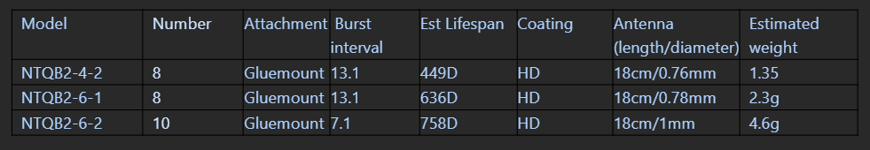
    <figcaption style="text-align: center; margin-top: 0.5em;">
      Table X: Pulse Interval depending Lotek nanotag models
    </figcaption>
  </figure>
</div>

```{r 4 Available vs Used BIRD USED TIME, message = FALSE, warning = FALSE, echo = TRUE, eval = TRUE, results = 'asis'}

# USED TIME (amount of time each bird spent during each category of tide and at each station)

# Provide the burst interval value depending Lotek-nano tag model (scd)
data_bird <- data_all %>%
  mutate(burst_inter = ifelse(tagModel == "NTQB2-6-2", dseconds(7.1), dseconds(13.1))) %>%
  select(timeAus, tideCategory, tideHighLow, tideDiel, sunriseNewc, sunsetNewc, 
         speciesEN, tagModel, recvDeployName, recv,speciesSci, Band.ID, burst_inter)

used_bird_recv_time <- data_bird %>%
  group_by(Band.ID, speciesEN, recvDeployName, tideCategory)  %>%
  summarise(duration_sec = sum(burst_inter)) %>%
  mutate(duration_h = round(duration_sec / 3600, 0),
         tideDiel = if_else(grepl("Diurnal", tideCategory), "Diurnal", "Nocturnal"),
         tideHighLow = if_else(grepl("High", tideCategory), "High", "Low")) %>%
  select(speciesEN, tideCategory, tideDiel, tideHighLow, duration_h, recvDeployName)

```
  
Now the *used* and *available* determined, we can start plotting the results.  

##### Rate of time *used* vs. *available*
  
  
As you will see within the two further plottings, putting available against used might be hard to read since the difference is big, plus, there are different available per species and station.  
So, a way to improve comprehension is to use percentage conversion and provide a *Rate of used time* in comparison to the *available*. Calculated as the following:  

\[
\frac{\text{Time used} \times 100}{\text{Time available}} \quad \text{across stations and species}
\]  

  
For more talkative results we filtered out Masked Lapwing and Far Eastern Curlew from the analysis, since they have too few data. And we removed two cases where the  *Rate of used time* was over the *available* (7176824 Bar-tailed Godwit in Curlew point at Nocturnal High Tide, and 6318617 Pacific Golden-Plover at Curlew Point during diurnal high tide). This occurs because multiplying each bird detection by its pulse interval duration overestimates the actual time used. For example, if a bird is detected twice with a 13-second pulse interval—once at second 1 and again at second 14—this results in 2 detections over 14 seconds. However, simply multiplying the detections by the pulse interval (2 × 13 seconds) incorrectly estimates the total time used as 26 seconds. This limitation is currently ignored and not taken into account into the analysis regarding the general low ratio time used/time available. We only filtered out these two cases.
  
Let's now generate this helpful *Rate of used time* value, then plot the results.  
  
  
```{r 4 Time Used Rate, message = FALSE, warning = FALSE, echo = TRUE, eval = TRUE, results = 'asis'}

figure_plot <- left_join(available_bird_recv_time %>% 
                           group_by(recvDeployName, Band.ID, speciesEN, tideCategory) %>%
                           rename(available_t = "duration_h"),
                         used_bird_recv_time %>%
                           rename(used_t = "duration_h")) %>%
  mutate(rate_use = used_t*100/available_t) %>%
  mutate(rate_use = ifelse(rate_use > 100, 100, rate_use)) %>%
  mutate(speciesType = case_when(speciesEN %in% c("Bar-tailed Godwit", "Far Eastern Curlew" , "Pacific Golden-Plover")~ "migratory",
                                 speciesEN %in% c("Masked Lapwing" , "Pied Stilt" , "Red-necked Avocet") ~ "resident") %>% 
           as_factor()) %>%
  filter(!speciesEN %in% c("Far Eastern Curlew", "Masked Lapwing"),
         rate_use != 100) 

```


Below are helpful data provided for plot design.   
  
  
```{r 4 design PLOT, message = FALSE, warning = FALSE, echo = TRUE, eval = TRUE, results = 'asis'}

# Color per sp
species_colors <- c(
  "Bar-tailed Godwit"      = "#1b9e77",
  "Far Eastern Curlew"     = "#d95f02",
  "Masked Lapwing"         = "#7570b3",
  "Pacific Golden-Plover"  = "#e7298a",
  "Pied Stilt"             = "#66a61e",
  "Red-necked Avocet"      = "#e6ab02",
  "available"              = "grey"
)

# Track size sample
counts <- used_bird_recv_time %>%
      group_by(speciesEN) %>%
      summarise(n = n_distinct(Band.ID)) %>%
      mutate(label = paste0(speciesEN, " (n = ", n, ")"))
label_vec <- setNames(counts$label, counts$speciesEN)
```

#### Results: Available vs Used {#results_avsu}

```{r 4 Available vs Used PLOT, message = FALSE, warning = FALSE, echo = TRUE, eval = TRUE, results = 'asis'}

# Combine dataset
used_bird_recv_time$type <- "used"
available_bird_recv_time$type <- "available"
combined_data <- bind_rows(used_bird_recv_time, available_bird_recv_time) %>%
  mutate(fill_color = ifelse(type == "available", "available", speciesEN),
         station_type = interaction(recvDeployName, type, lex.order = TRUE))

# Plot function available vs. used
plot_by_tide <- function(tide_cat) {
  data_subset <- combined_data %>% filter(tideCategory == tide_cat)
  
  ggplot(data_subset, 
         aes(x = recvDeployName, y = duration_h, 
             fill = fill_color)) +
    
    geom_boxplot(position = position_dodge2(width = 0.9, preserve = "single")) +
    scale_fill_manual(values = species_colors, name = "Type") +
    
    facet_wrap(~ speciesEN, scales = "free_y", 
               labeller = labeller(speciesEN = label_vec)) +

    theme_minimal(base_size = 12) +
    theme(strip.text = element_text(face = "bold", size = 8),
          strip.text.x = element_text(face = "plain", size = 8),
          axis.text.x = element_text(angle = 45, hjust = 1),
          legend.position = "none",
          plot.margin = margin(0, 0, 0, 0, "in"))  +
    
    coord_cartesian(ylim = c(0, NA)) +     
    labs(x = "MOTUS Stations",
         y = "Detection duration (hours)",
         title = paste("Tide Category:", tide_cat),
         fill = "Type",
         caption = "Used (colors) vs. Available (grey)")
  }

# Get unique tideCategory levels
tide_categories <- combined_data %>%
  filter(!is.na(tideCategory)) %>%
  pull(tideCategory) %>%
  unique()

# Generate a list of plots for all tide categories
plots_list <- purrr::map(tide_categories, plot_by_tide)

```


::: panel-tabset

##### Nocturnal High  Tide

```{r 4 1, message = FALSE,  warning = FALSE, echo = FALSE, eval = TRUE, results = 'asis'}
plots_list[[1]]
```

##### Diurnal Low Tide

```{r 4 2, message = FALSE,  warning = FALSE, echo = FALSE, eval = TRUE, results = 'asis'}

plots_list[[2]]
```

##### Diurnal High Tide

```{r 4 3, message = FALSE,  warning = FALSE, echo = FALSE, eval = TRUE, results = 'asis'}

plots_list[[3]]
```

##### Nocturnal Low Tide

```{r 4 4, message = FALSE,  warning = FALSE, echo = FALSE, eval = TRUE, results = 'asis'}

plots_list[[4]]
```
:::

FIGURE 1 : Shorebird movement and spatial ecology vary across species and within the local MOTUS array in NSW. Each tab displays one category from the pairs "high/low" and "nocturnal/diurnal," showing *used time* for each species at different MOTUS stations (red boxes). The blue box on the left represents the total *available time* for the corresponding tide category across individuals.
Note that *available time* is similar across stations as it is based on the general Newcastle tide table, since station-specific tide data is unavailable.  
  
    
#### Results: Used {#results_u}
  
Since the size sample at the current date is too low, it might be hard to read in details how much each bird or species spent time (hours) at each MOTUS station. So here below is displayed the *used* only for each stations.
  
  
```{r 4 Used PLOT, message = FALSE, warning = FALSE, echo = TRUE, eval = TRUE, results = 'asis'}

# Plot function used ONLY
plot_used <- function(tide_cat) {
  data_subset <- used_bird_recv_time %>% filter(tideCategory == tide_cat)
  
  ggplot(data_subset, 
         aes(x = recvDeployName, y = duration_h, fill = speciesEN)) +
    
    geom_boxplot(position = position_dodge2(width = 0.9, preserve = "single")) +
    scale_fill_manual(values = species_colors, name = "Species") +
    
    facet_wrap(~ speciesEN, scales = "free_y", 
               labeller = labeller(speciesEN = label_vec)) +
    
    theme_minimal(base_size = 12) +
    theme(strip.text = element_text(face = "bold", size = 10),
          axis.text.x = element_text(angle = 45, hjust = 1),
          legend.position = "none",
          plot.margin = margin(0, 0, 0, 0, "in"))  +
    
    coord_cartesian(ylim = c(0, NA)) + 
    labs(x = "MOTUS Stations",
         y = "Detection duration (hours)",
         title = paste("Tide Category:", tide_cat),
         fill = "Species")
  }

# Get unique tideCategory levels
tide_categories <- combined_data %>%
  filter(!is.na(tideCategory)) %>%
  pull(tideCategory) %>%
  unique()

# Generate a list of plots for all tide categories
plots_list_used <- purrr::map(tide_categories, plot_used)

```


::: panel-tabset

##### Nocturnal High  Tide

```{r 4 used 1, message = FALSE,  warning = FALSE, echo = FALSE, eval = TRUE, results = 'asis'}
plots_list_used[[1]]
```

##### Diurnal Low Tide

```{r 4 used 2, message = FALSE,  warning = FALSE, echo = FALSE, eval = TRUE, results = 'asis'}

plots_list_used[[2]]
```

##### Diurnal High Tide

```{r 4 used 3, message = FALSE,  warning = FALSE, echo = FALSE, eval = TRUE, results = 'asis'}

plots_list_used[[3]]
```

##### Nocturnal Low Tide

```{r 4 used 4, message = FALSE,  warning = FALSE, echo = FALSE, eval = TRUE, results = 'asis'}

plots_list_used[[4]]
```
:::  


#### Results: Time Used Rate {#time_used_rate}  
  
```{r 4 Used rate PLOT, message = FALSE, warning = FALSE, echo = TRUE, eval = TRUE, results = 'asis'}

# Tide and species groupings
tide_levels <- c("Low", "High")
species_types <- c("resident", "migratory")

# Function to generate a plot for a given combination
make_plot <- function(tide_levels, species_types) {
  ggplot(figure_plot %>%
           filter(tideHighLow == tide_levels, speciesType == species_types),
         aes(x = factor(recvDeployName, levels = sort(unique(recvDeployName))),
             y = rate_use,
             fill = tideDiel)) +
    geom_boxplot() +
    facet_wrap(~ speciesEN,
               labeller = labeller(speciesEN = label_vec)) +    
    labs(
      x = "Receiver Deployment",
      y = "Rate of Use (%)",
      fill = "Tide Diel",
      title = paste(
        ifelse(species_types == "migratory", "Migratory species", "Resident species"),
        "during", tide_levels, "tide"
      )
    ) +
    scale_y_continuous(limits = c(0, 100)) +
    theme_minimal() +
    scale_fill_manual(values = c("Diurnal" = "white", "Nocturnal" = "darkgrey")) +
    theme(axis.text.x = element_text(angle = 45, hjust = 1))
}


# Generate and store all plots in a list
plots_used_rate <- cross2(tide_levels, species_types) %>%
  purrr::map(~ make_plot(.x[[1]], .x[[2]]))

```

**MIGRATORY BIRDS**  

::: panel-tabset

##### High Tide

```{r 4 Used rate 1, message = FALSE,  warning = FALSE, echo = FALSE, eval = TRUE, results = 'asis'}
plots_used_rate[[4]]
```

##### Low Tide

```{r 4 Used rate 2, message = FALSE,  warning = FALSE, echo = FALSE, eval = TRUE, results = 'asis'}

plots_used_rate[[3]]
```
:::  


**RESIDENT BIRDS**  

::: panel-tabset

##### High Tide

```{r 4 Used rate 3, message = FALSE,  warning = FALSE, echo = FALSE, eval = TRUE, results = 'asis'}
plots_used_rate[[2]]
```

##### Low Tide

```{r 4 Used rate 4, message = FALSE,  warning = FALSE, echo = FALSE, eval = TRUE, results = 'asis'}

plots_used_rate[[1]]
```
:::  


<button
  class="backBtn"
  data-target="contents4bis" 
  onclick="document.getElementById(this.getAttribute('data-target')).scrollIntoView({behavior: 'smooth'});"
  style="position: fixed; bottom: 20px; right: 20px; z-index: 9999; padding: 10px 15px; background-color: #007bff; border: none; border-radius: 5px; color: white; cursor: pointer; box-shadow: 0 2px 4px rgba(0,0,0,0.3); display: none;">
  Back to Contents
</button>


## 5. Shorebirds behaviour

### [Contents]{#contents5 style="color: grey; font-size: smaller;"}

-   [Packages](#packages5)
-   [Load the data](#load-the-data5)
-   [Adding crucial variables](#adding5)
-   [Plotting results](#plotting5)

---

### Packages {#packages5}

```{r 5 packages, message = FALSE, warning = FALSE, eval = TRUE}

library(dplyr)
library(here)
library(forcats) 
library(lubridate)
library(purrr) 
library(lubridate)
library(ggplot2)
library(stringr)

```

### Load the data {#load-the-data5}

Either load your own data generated across the previous chapters (.rds format), or download the data up to the-last-document-update date provided here below (contact maxime.marini\@uon.edu.au for password access):

Receiver information: <a href="#" onclick="return checkPassword('recv')">recv-info.rds</a><br>
Bird data: <a href="#" onclick="return checkPassword('bird')">data.rds</a>

```{=html}
<script>
  function checkPassword(type) {
    var correctPasswords = {
      recv: "provence13",
      bird: "provence13"
    };
    var urlLinks = {
      recv: "https://uoneduau-my.sharepoint.com/:u:/g/personal/c3541851_uon_edu_au/EemdZD3VJUdHvkVoKbqUhsABCJekUx7zYJ-_5snIw0BI4A?e=RRnDGy",
      bird: "https://uoneduau-my.sharepoint.com/:u:/g/personal/c3541851_uon_edu_au/EU1v7RPMqwZGi-fapl0G620BYQVUbAQcr1tHyDqgsEPBKg?e=pfZgDd"
    };
    var userPassword = prompt("Please enter the password to access the link:");
    if (userPassword === correctPasswords[type]) {
      window.open(urlLinks[type], '_blank');
    } else {
      alert("Incorrect password. Access denied.");
    }
    return false; // prevent default link behavior
  }
</script>
```

To properly load the data into your environment, make sure to set the working directory and the path as yours.

```{r 5 load data 1, eval = FALSE}
# Set WD
setwd(dirname(rstudioapi::getSourceEditorContext()$path)) 
# Birds
data_all <- readRDS(here::here("data", "recv.info.rds"))
# Receivers info
recv <- readRDS(here::here("data", "data.rds")) 
```

```{r 5 load data 2, echo = FALSE, eval = TRUE}

# Birds
data_all <- readRDS(
  tail(sort(list.files(
  here::here("1_data", "alltags", "motus.rds"),
  pattern = "-data\\.rds$", full.names = TRUE
  )), 1)) # pick up the most recent .rds file

# Receivers info
recv <- readRDS(
  tail(sort(list.files(
    here::here("1_data", "alltags", "motus.rds"),
    pattern = "-recv-info\\.rds$", full.names = TRUE
  )), 1)) 

# Selecting upon our needs
data <- data_all %>%
  select(Band.ID, recvDeployName, recv, speciesEN, sig, sigsd, sigPositive, tideCategory, timeAus)

```

### Adding crucial variables {#adding5}

```{r 5 compute variables, echo = TRUE, eval = TRUE}

# Mean signal strengh per individual, site and time categories (HD, HN, LD, LN)
data <- data %>%
  group_by(Band.ID, tideCategory, recvDeployName) %>%
  mutate(sig_indiv_tideCat = mean(sigPositive)) %>%
  ungroup()  %>%
  mutate(speciesINIT = str_split(speciesEN, " ") %>%            
           map_chr(~ str_c(str_sub(.x, 1, 1), collapse = "")) %>%    
           toupper(),
         tideCat = str_split(tideCategory, "_") %>%          
           map_chr(~ str_c(str_sub(.x, 1, 1), collapse = "")) %>%    
           toupper())

```

Here, we take the raw values of signal strength `sig` to calculate the mean for each individual and per tide category `tideCategory`. So we can group the means per species and per site to observ how the signal strength varies. To that aim, we need to create a new variable: the average signal strength per individuals `sig_indiv_tideCat`.

### Plotting results {#plotting5}

Below is displayed the variance of the signal strength among species and Motus stations.Hypotesising that foraging activity (high variance values) would more occur in Low tide context, or/and at night.

```{r 5 plotting results , echo = FALSE, eval = TRUE}

# Color codes
species_colors <- c(
  "Bar-tailed Godwit"      = "#1b9e77",  
  "Far Eastern Curlew"     = "#d95f02",  
  "Masked Lapwing"         = "#7570b3", 
  "Pacific Golden-Plover"  = "#e7298a", 
  "Pied Stilt"             = "#66a61e", 
  "Red-necked Avocet"      = "#e6ab02"   
)

speciesINIT_colors <- c(
  "BG"  = "#1b9e77", 
  "FEC" = "#d95f02",  
  "ML"  = "#7570b3",  
  "PG"  = "#e7298a",  
  "PS"  = "#66a61e", 
  "RA"  = "#e6ab02"   
)

```


```{r 5 plotting results2BIS, echo = TRUE, eval = TRUE, results = 'asis'}
# One plot per species for better understanding
plots_list <- data %>%
  split(.$speciesEN) %>%
  purrr::map(~ ggplot(.x, aes(x = tideCat, y = sig_indiv_tideCat, fill = speciesEN)) +
        geom_boxplot() +
        facet_wrap(~ recvDeployName) +
        scale_fill_manual(values = species_colors, guide = "none") +
        theme_bw() +
        labs(
          title = paste0("Signal Strength variance for ", unique(.x$speciesEN), " over MOTUS stations"),
          x = "Tide Category",
          y = "Signal Strength variance (RSSI)",
          fill = "Species"
        ))

names(plots_list) <- c("BTG", "FEC", "ML", "PGP", "PS", "RNA")

# Save each plot as a JPEG file
for (species_name in names(plots_list)) {
  filename <- here::here("docs", "figures", paste0(species_name, ".jpg"))
  jpeg(filename, width = 800, height = 600)
  print(plots_list[[species_name]])
  dev.off()
}
```

::: panel-tabset

### Bar-tailed Godwit
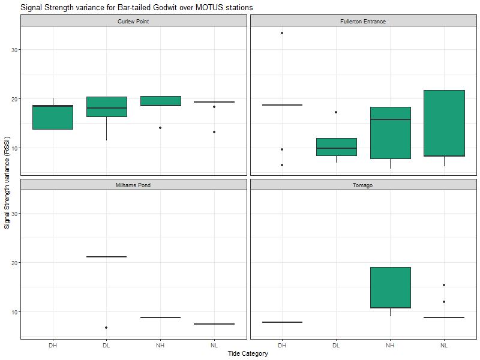

### Far Eastern Curlew
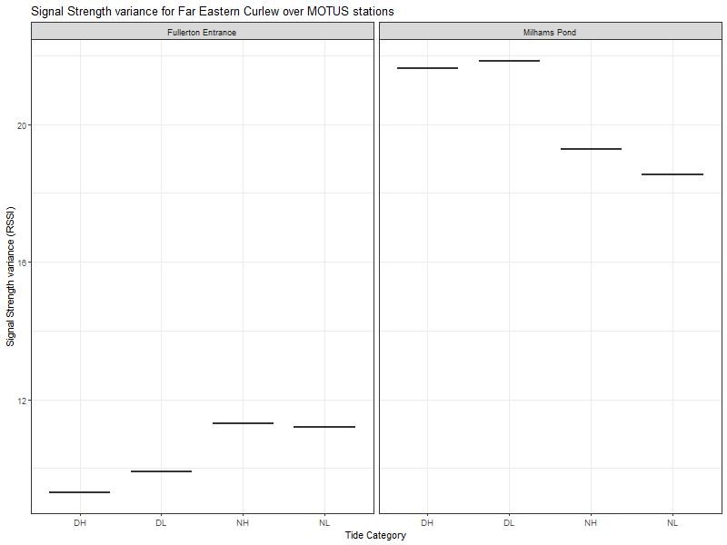

### Masked Lapwing
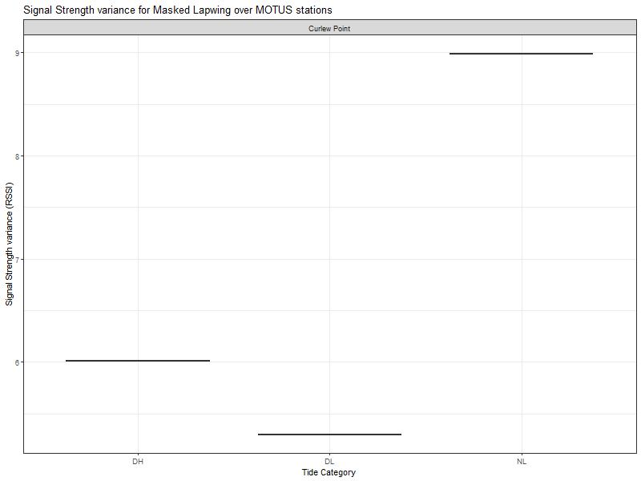

### Pacific Golden-Plover
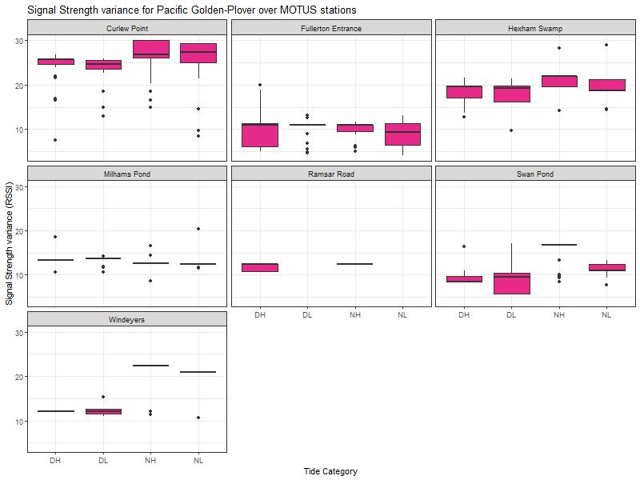

### Pied Stilt
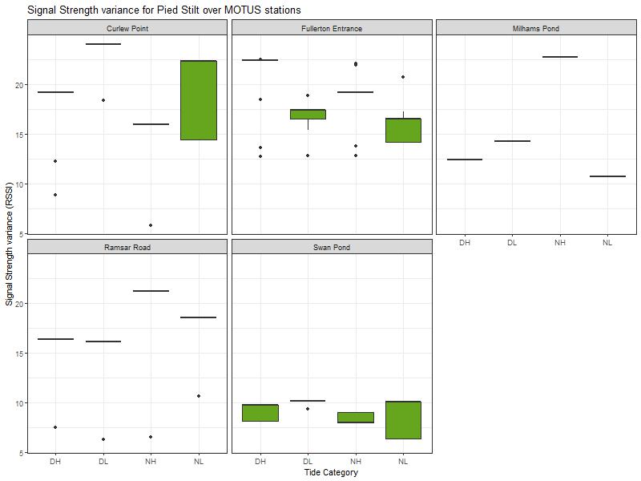

### Red-necked Avocet
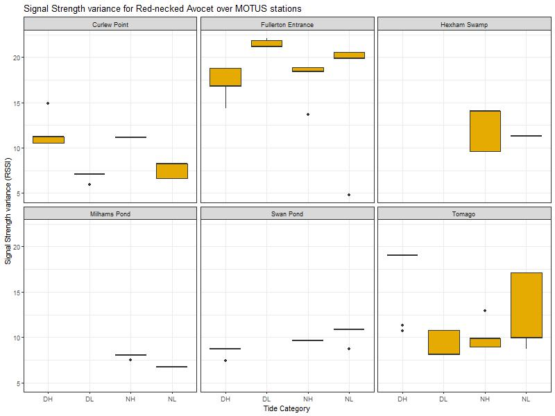

:::

<button
  class="backBtn"
  data-target="contents5" 
  onclick="document.getElementById(this.getAttribute('data-target')).scrollIntoView({behavior: 'smooth'});"
  style="position: fixed; bottom: 20px; right: 20px; z-index: 9999; padding: 10px 15px; background-color: #007bff; border: none; border-radius: 5px; color: white; cursor: pointer; box-shadow: 0 2px 4px rgba(0,0,0,0.3); display: none;">
  Back to Contents
</button>

::::::

<script>
document.addEventListener("DOMContentLoaded", function() {
  const buttons = Array.from(document.querySelectorAll(".backBtn"));
  window.addEventListener("scroll", function() {
    let scrollPos = window.pageYOffset || 
                    document.documentElement.scrollTop || 
                    document.body.scrollTop || 0;
    let buttonToShow = null;
    buttons.forEach(function(btn) {
      let targetId = btn.getAttribute("data-target");
      if (!targetId) return;
      let targetEl = document.getElementById(targetId);
      if (!targetEl) return;
      if (scrollPos > targetEl.offsetTop + 100) {
        if (!buttonToShow || targetEl.offsetTop > document.getElementById(buttonToShow.getAttribute("data-target")).offsetTop) {
          buttonToShow = btn;
        }
      }
    });
    buttons.forEach(function(btn) {
      if (btn === buttonToShow) {
        btn.style.display = "block";
      } else {
        btn.style.display = "none";
      }
    });
  });
});
</script>


***Availability***

*The analysis are ran through R version 4.5.1 (2025-06-13 ucrt) -- "Great Square Root" and the platform: x86_64-w64-mingw32/x64.*

```{r check, echo = FALSE, eval = FALSE}

############ /!\ always check /!\ #############

# spreadsheet up to date
# downloadable data into the share-point up to date + the link to access matching the up to date data file
# once the filtering done, check every argument being ID when referencing to individuals


```
