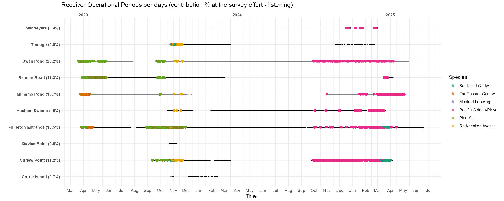

<p style="font-size: 0.7em; color: gray;"> Created on July 28, 2025 </p>

## [*Maxime Marini, Callum Gapes, Andrea S. Griffin*]{style="font-size: 0.8em;"}

\

# [Material]{.smallcaps}

Multiple variables might influence the movement of migratory shorebirds within there foraging ground (ie. Hunter & Port Stephen estuaries), selecting different areas at different times whether to roost or forage. Those variables might vary across species and individuals, therefore their selected habitat. Within such an interdependent system, we try to suggest an approach that takes into account the tidal and circadian cycles as the main drivers to the habitat selection.

1.  **MOTUS telemetry technology**

<p style="font-size: 0.9em; color: gray;">

*Overview about the MOTUS array and its combination with Lotek VHF devices used within the study. How does this work?*

</p>

2.  **The local MOTUS array**

<p style="font-size: 0.9em; color: gray;">

*See how, where and where our array is set-up.*

</p>

3.  **The deployed tags**

<p style="font-size: 0.9em; color: gray;">

*Keep track on what tags are deployed over our migratory shorebirds.*

</p>

::: blockquote-blue
Navigate the three different tabs below to get deeper into the [material]{.smallcaps} used.
:::

::: panel-tabset
## Close tabs

## 1. MOTUS telemetry technology

To be continued ...

## 2. The local MOTUS array

To be continued ...

## 3. The deployed tags

To be continued ...
:::

# [Method]{.smallcaps}

This following aims to describe the analysis ran with VHF Motus data set that tries to access the complex articulation of habitat selection from migratory shorebirds across and within estuaries habitats. The analysis tackles several key points before properly studying migratory shorebirds spatial ecology as described as below:

1.  **Filtering the data**

<p style="font-size: 0.9em; color: gray;">

*Aims to clean out, simplify and format the raw data set from Motus network (.sql) to an easier table (.rds). Remove false positive signals, clarify ambiguous detection and add useful variables (ie. tide cycle, circadian cycle, etc.).*

</p>

2.  **Relative site usage**

<p style="font-size: 0.9em; color: gray;">

*The local deployed Motus array is composed of 8 receivers that suppose to 7/24 'listen' the tag signals, sent by the devices settled on birds, potentially within their range of reception. However, all the receivers did not 'listen' the same amount of time for multiple reasons (ie. date of networked, temporary out of servicing, etc.). Hence, the temporal coverage is unequal across the receivers meaning the survey effort -7/24 'listening'- is not comparable. This chapter access this bias by suggesting a site usage from bird, relative to the station effort survey.*

</p>

3.  **Motus array suitability**

<p style="font-size: 0.9em; color: gray;">

*All the bird we are focused on do not share the same land-use. That means the built-up array can not be suitable at the best for every species since the receivers are permanently settled at specific sites across the estuaries. Among all the deployed tags, which ones are the best surveyed within the local Motus array?*

</p>

4.  **Habitat selection**

<p style="font-size: 0.9em; color: gray;">

*Descriptive & inferential analysis are conducted.* *First is visually compared the spatial occupancy from birds and over our Motus array depending two main factors: tide and circadian cycles.*

</p>

::: blockquote-blue
Navigate the four different tabs below to get deeper into the [method]{.smallcaps} used.
:::

:::::: panel-tabset
## Close tabs

## 1. Filtering the data

### [Contents]{#contents1 style="color: grey; font-size: smaller;"}

-   [Packages](#packages)
-   [Download the data from Motus network](#download-the-data-from-motus-network)
-   [Filter the data](#filter-the-data)
-   [Adding variables](#adding-variables)
-   [Set survey time frame](#set-timeframe)

### Packages {#packages}

```{r 1 packages, message = FALSE, warning = FALSE, eval = TRUE, echo = TRUE}

# install.packages("motus", 
#                  repos = c(birdscanada = 'https://birdscanada.r-universe.dev',
#                            CRAN = 'https://cloud.r-project.org'))
library(motus)
library(dplyr)
library(here)
library(DBI)
library(RSQLite)
library(forcats) 
library(lubridate)
library(bioRad) 
library(purrr) 
```

### Download the data from Motus network {#download-the-data-from-motus-network}

```{r 1 settings, message = FALSE, warning = FALSE, eval = FALSE, echo = TRUE}

# Global settings
setwd(dirname(rstudioapi::getSourceEditorContext()$path)) 
Sys.setenv(TZ="UTC") 
proj.num <- 294  
motusLogout()
```

Set general settings first as working directory, Time Zone, Motus project number (ie. ours is 294). And make sure the environment is free from any connection to any other networked project or from any other Motus user account (avoid undesired mistakes).

```{r 1 download data, message = FALSE, warning = FALSE, eval = FALSE, echo = TRUE}
sql.motus <- tagme(projRecv = proj.num,
                   new = FALSE, # TRUE overwrites existing (large data takes a while) FALSE used to update existing file
                   update = TRUE,
                   dir = here("data"))

metadata(sql.motus, proj.num)

sql.motus <- dbConnect(SQLite(), here::here("data", "project-294.motus"))

df.alltags <- tbl(sql.motus, "alltags") %>%
  dplyr::collect() %>%
  as.data.frame() %>%
    mutate(time = as_datetime(ts),
         timeAus = as_datetime(ts, tz = "Australia/Sydney"),
         dateAus = as_date(timeAus),
         year = year(time), 
         doy = yday(time))
```

`motus::tagme()`gets the data from the online Motus network, the ones part of your project (ie. ID = 294) only. Make sure you set your own directory. A file of type .sql is automatically created.

`motus::metadata()` downloads the metadata from the online Motus network (receiver information and more).

`motus::dbConnect()` links your .sql to your environment. Avoid to use high memory as .sql is a *lazy* table and not yet hardly written on your hardware.

`motus::tbl()` extracts all the tags fat into your environment. Then formatted into a classic dataframe.

### Filter the data {#filter-the-data}

::: blockquote-red
**WARNING**: The values entered within the below filtering R code are depending your own context.
:::

```{r 1 filter the data, message = FALSE, warning = FALSE, eval = FALSE, echo = TRUE}
# Cleaning and correcting tags metadata
df.alltags <- df.alltags %>% 
   filter(
    # test tags
     motusTagID != c("43291"),
    # pending, unconfirmed or undeployed tags
    !motusTagID %in% c("43288", "43291", "43297", "43299",
                       "43307", "43424", "43425", "60470", 
                       "60579", "81123", "81136", "81137"),
    # used for test/validation before tagging bird (remove time before the tagging)
    !(motusTagID == "81134" & time < dmy("23-11-2024")),
    !(motusTagID == "60575" & time < dmy("25-10-2023")) ) %>% 
    # NA species
     mutate(speciesEN = case_when(
       is.na(speciesEN) & motusTagID %in% c("60470", "81121") ~ "Red-necked Avocet",
       is.na(speciesEN) & motusTagID %in% c("81118") ~ "Red-necked Avocet",
       TRUE ~ speciesEN))
  
# Cleaning and correcting receiver metadata
df.alltags <- df.alltags %>% 
  filter(
    # NA
     !is.na(recvDeployLat),
    # site not any longer used
      recvDeployName != c("Throsby Creek Test Site"),
    # test sensor gnome
      recv != c("SG-C621RPI3E17F",       
                "SG-62A5RPI36710") ) %>% 
  mutate(recvDeployName = ifelse(is.na(recvDeployName) & recv == "SG-D5BBRPI3E2F7", "Windeyers", recvDeployName))
```

Here are cleaned-out the data recorded from undesired tags and/or receivers depending our local context.

Have been removed: test tags, tags recorded into the Motus project but undeployed, period of time where tags were *ON* but not set on any bird, test sensor gnome, sites not any longer used. Receiver station's name has been changed from *NA* to Windeyers starting from 02/15/2025. Tag's *specieEN* information have been changed from *NA* to different values depending case to case.

```{r 2 filter the noise, message = FALSE, warning = FALSE, eval = FALSE, echo = TRUE}
# False positive
df.alltags <- df.alltags %>% 
  filter(motusFilter == 1, # 0 is invalid data
         runLen >= 3) # value to be further thought

# Ambiguous 
clarify(sql.motus)
```

Then the False Positive signals are put away (ie. noise coming from external device, or any kind of external radio activity happening within the area) thanks to pre-made Motus filter and \`runLen\` threshold value, here set at 3. This value defines the number of bursts recorded from one tag and received at once, too low amount of burst are suspected for not being True Positif so not reliable.

`motus::clarify()` checks whether the combination of two tag signals emitting at the mean time could generate the detection of a third tag signal, which would be a False Positive on its own, but also hidding the two True Positives. If the table generated by this code has rows resulting, please go to [Motus documentation.](https://motuswts.github.io/motus/articles/05-data-cleaning.html).

### Adding variables {#adding-variables}

```{r 1 Tide data, message = FALSE, warning = FALSE, eval = FALSE, echo = TRUE}
# Load tide (Callum work 01_import_tide_data.R)
tidalCurve <- readRDS(here::here("1_data", "tides", "tidalCurve.rds"))
tideData <- readRDS(here::here("1_data", "tides", "tideData.rds"))
tidalCurveFunc <- splinefun(tideData$tideDateTimeAus, tideData$tideHeight, method = "natural")
get.tideIndex <- function(time){ return(which.min(abs(tideData$tideDateTimeAus-time)))}
```

Note that the raw Tide data-set is not provided here. Since it has been manually extracted from [New South Wales government resources](https://www.nsw.gov.au/sites/default/files/2024-06/tide-tables-24-25-nsw.pdf) and formatted by [Callum Gapes](https://www.linkedin.com/in/callum-g/?originalSubdomain=au) through this [method](https://uoneduau-my.sharepoint.com/:u:/g/personal/c3541851_uon_edu_au/EWOk05RFs1xJhAWLBddbf-kB_H2xRuz0XPUWtPVfcju_-Q?e=P6WzOT).

```{r 1 variable, message = FALSE, warning = FALSE, eval = FALSE, echo = TRUE}
df.alltags <- df.alltags %>% 
  
# Sunrise/set
  sunRiseSet(lat = "recvDeployLat", 
             lon = "recvDeployLon", 
             ts = "ts") %>% 
  mutate(sunriseNewc = sunrise(dateAus, 151.7833, -32.9167, elev = -0.268, tz = "Australia/Sydney", force_tz = TRUE),
         sunsetNewc = sunset(dateAus, 151.7833, -32.9167, elev = -0.268, tz = "Australia/Sydney", force_tz = TRUE)) %>%
  
# Positive signal strength (min. = 0) for plotting
  mutate(sigPositive = sig + abs(min(sig))) %>%
  
# As Factor
  mutate(motusTagID = as.factor(motusTagID))

# Tide
df.alltags <- df.alltags %>% 
  mutate(tideHeight = tidalCurveFunc(timeAus),
         tideIndex = map_dbl(timeAus, get.tideIndex))

tide_values <- tideData[df.alltags$tideIndex, 
                        c("tideDateTimeAus",
                          "high_low",
                          "day_night",
                          "tideCategory",
                          "tideID",
                          "tideHeight")]

df.alltags <- df.alltags %>%
  mutate(tideDateTimeAus = tide_values$tideDateTimeAus,
         tideHighLow = as_factor(tide_values$high_low),
         tideDiel = as_factor(tide_values$day_night),
         tideCategory = as_factor(tide_values$tideCategory),
         tideCategoryHeight = tide_values$tideHeight,
         tideID = as_factor(tide_values$tideID),
         tideTimeDiff = abs(difftime(timeAus, tideDateTimeAus, units = "hours")) ) # Time diff btw detect. & nearest tide pts

```

Several variables are added as some are formatted and/or renamed for the aims of the study.

```{r 1 recv, message = FALSE, warning = FALSE, eval = FALSE, echo = TRUE}
# Get summary
df.recvDeps <- tbl(sql.motus, "recvDeps") %>% 
  collect() %>% 
  as.data.frame() %>%
    mutate(timeStart = as_datetime(tsStart),
         timeStartAus = as_datetime(tsStart, tz = "Australia/Sydney"),
         timeEnd = as_datetime(tsEnd),
         timeEndAus = as_datetime(tsEnd, tz = "Australia/Sydney"))

# Rename stations across alltags & receiver data-sets
station_rename <- list(
   "Barry_Fullerton_cove"  = "Fullerton Entrance",
   "North Swann Pond"      = "Swan Pond" ,
   "Ramsar Road Floodgate" = "Ramsar Road",
   "Milham's Pond"         = "Milhams Pond")
df.recvDeps <- df.recvDeps %>% 
  mutate(name = recode(name, !!!station_rename)) %>%
  rename(recvDeployName = "name")

df.alltags <- df.alltags %>% 
  mutate(recvDeployName = recode(recvDeployName,
                                 !!!station_rename))
  
# Filter not used stations as out of the local array
df.recvDeps <- df.recvDeps %>% 
     filter(!is.na(recvDeployLat),
          recvDeployName != c("Throsby Creek Test Site"),
          recv != c("SG-C621RPI3E17F",       # test station
                    "SG-62A5RPI36710") )     # test station

```

Rename here the receiver of your array for a better comprehension. Also, remove the stations that are not any longer used.

### Set survey time frame {#set-timeframe}

```{r 1 final filtering, message = FALSE, warning = FALSE, eval = FALSE, echo = TRUE}
df.recvDeps <- df.recvDeps %>%
  filter(timeStartAus > "2023-01-31 00:00:00 AEDT") 
```

Finally, set the *survey effort* starting day from our local Motus array, as one month before the first day a bird has been caught and tagged (information found into the [sharepoint](https://uonstaff.sharepoint.com/:x:/r/sites/StudentGroupPhD-LouiseWilliamsandMatteaTaylor/_layouts/15/Doc2.aspx?action=edit&sourcedoc=%7Ba23e66f0-c551-4ba4-acd0-de0d5e83ca42%7D&wdOrigin=TEAMS-MAGLEV.teamsSdk_ns.rwc&wdExp=TEAMS-TREATMENT&wdhostclicktime=175385) to access the file.).

```{r 1 save .rds, message = FALSE, warning = FALSE, eval = FALSE, echo = TRUE}
saveRDS(df.alltags, here::here("data", paste0(Sys.Date(), "-data", ".rds" )))
saveRDS(df.recvDeps, here::here("data", paste0(Sys.Date(), "-recv-info", ".rds" )))
```

Save your now formatted data, ready for use. Automatically named with the date of your saving.

<button
  class="backBtn"
  data-target="contents1" 
  onclick="document.getElementById(this.getAttribute('data-target')).scrollIntoView({behavior: 'smooth'});"
  style="position: fixed; bottom: 20px; right: 20px; z-index: 9999; padding: 10px 15px; background-color: #007bff; border: none; border-radius: 5px; color: white; cursor: pointer; box-shadow: 0 2px 4px rgba(0,0,0,0.3); display: none;">
  Back to Contents
</button>


## 2. Relative site usage

### [Contents]{#contents2 style="color: grey; font-size: smaller;"}

-   [Packages](#packages2)
-   [Load the data](#load-the-data2)
-   [Clarifying deviceID and stations](#clarifying2)
-   [Extracting listening periods per stations](#extracting2)
-   [MOTUS array survey effort](#survey-effort2)

### Packages {#packages2}

```{r 2 packages, message = FALSE, warning = FALSE, eval = TRUE}

library(motus)
library(dplyr)
library(here)
library(forcats) 
library(ggplot2)
library(lubridate)
library(tidyr)

```

### Load the data {#load-the-data2}

Either load your own data by connecting through `DBI::dbConnect(RSQLite::SQLite())` and calling the data with `tbl(sql.motus, "activity")`, or download the data up to the-last-document-update date provided here below (contact maxime.marini\@uon.edu.au for password access):

Receiver activity: <a href="#" onclick="return checkPassword('recv')">recv.act.rds</a><br>

```{=html}
<script>
  function checkPassword(type) {
    var correctPasswords = {
      recv.act: "provence13",
    };
    var urlLinks = {
      recv.act: "https://uoneduau-my.sharepoint.com/:u:/g/personal/c3541851_uon_edu_au/EcizeHaA5kpHhluczVvJ5_4BoU4nfvFLtLGr0uTOPzsqng?e=FIF1gA",
    };
    var userPassword = prompt("Please enter the password to access the link:");
    if (userPassword === correctPasswords[type]) {
      window.open(urlLinks[type], '_blank');
    } else {
      alert("Incorrect password. Access denied.");
    }
    return false; // prevent default link behavior
  }
</script>
```

To properly load the data into your environment, make sure to set the working directory and the path as yours.

```{r 2 load data 1, eval = FALSE}
# Set WD
setwd(dirname(rstudioapi::getSourceEditorContext()$path)) 
# Birds
data_all <- readRDS(here::here("data", "recv.info.rds"))
# Receivers info
recv <- readRDS(here::here("data", "data.rds")) 
# Receiver activity
recv.act <- readRDS(here::here("data", "recv.act.rds")) 
```

```{r 2 load data 2, echo = FALSE, eval = TRUE}

# Birds
data_all <- readRDS(
  tail(sort(list.files(
    here::here("1_data", "alltags", "motus.rds"),
    pattern = "-data\\.rds$", full.names = TRUE
  )), 1)) 

# Receivers info
recv <- readRDS(
  tail(sort(list.files(
    here::here("1_data", "alltags", "motus.rds"),
    pattern = "-recv-info\\.rds$", full.names = TRUE
  )), 1)) 

# Receivers activity
sql.motus <- DBI::dbConnect(RSQLite::SQLite(), here::here("1_data", "alltags", "project-294.motus"))
recv.act <- tbl(sql.motus, "activity")  %>% 
  collect() %>% 
  as.data.frame() %>%
  rename(deviceID = "motusDeviceID") %>%
  filter(deviceID %in% unique(recv$deviceID)) %>% # keep our deployed antennas only 
  
  # Set the time properly - IMPORTANT
  mutate(date = as_datetime(as.POSIXct(hourBin* 3600, origin = "1970-01-06", tz = "UTC")),
         dateAus = as_datetime(as.POSIXct(hourBin* 3600, origin = "1970-01-06", tz = "UTC"), 
                             tz = "Australia/Sydney")) 

```

```{r 2 check the data,  message = FALSE, warning = FALSE, eval = TRUE}

head(recv.act)
table(is.na(recv.act$pulseCount), recv.act$numTags)  
table(is.na(recv.act$pulseCount) & is.na(recv.act$numTags))

```

`pulseCount`:Antenna pulses are a reflection of environmental noise and consist of radio pulses at the nominal listening frequency (e.g.; 166.38 MHz) which did not correspond to a known tag signature. The number of radio pulses measured on each antenna over each hour period (hourBin) - [`Motus documentation, 2025`](https://docs.motus.org/en/stations/station-inspection/up-time-and-detectability#antenna-pulses){target="_blank"} . `numTags`: Variable in the Motus SQL data (including the activity table and functions that generate site or tag summaries) represents the total number of unique tags detected within a given context—typically at a site, within a batch, or for a set of detections.

::: blockquote-red
**Note** that when `pulseCount` is NA, no noise has been recorded while one or several tags have been recorded. When no tag has been recorded but noise happened, `numTags` = 0 and `pulseCount` \> 0. So a case when a station is actually listening has either values or NA for `pulseCount` or/and for `numTags` variables. In other words, when a station is not listening, there is no row at all in the table (no data recorded).

**Keep in mind** What we can miss, are the hours where no tag or noise are happening within the environment BUT the antenna still being "listening". In such a case, let's further assume than the antenna is not working/listening since "no noise" condition during more than an hour may be extremely rare.
:::

### Clarifying deviceID and stations {#clarifying2}

One issue within the Motus data is the number of variables related to IDs (receivers, Raspberry Pi, sites, etc.) and the unconsistent names for the same variable across the different tables (ie. `recv$serno` = `alltags$recv`). Plus, some of our SensorGnome devices `serno` (black boxes containing a Raspberry Pi processor) have been swapped between sites to optimize the array survey. For example, when two stations need their devices repaired, we first remove the devices from their antennas to fix them. When re-installing, we prioritise placing the repaired device at the site where it is most needed, regardless of which station it originally came from.

Since the survey effort is accessed through the `hourBin` depending `deviceID` within the `activity` table, we need to re-associate each deviceID with their corresponding stations (`recvDeployName`) at the corresponding time/period. We'll first create a unique ID that matches station's name with `deviceID`: `SernoStation`.

```{r 2 clarifying stations,  message = FALSE, warning = FALSE, eval = TRUE}

# Sort the terminated serno (if terminated, ie. one box has been removed from one antenna site, and a date comes along recv$timeEndAus variable)
recv.act.term <- recv.act %>%
  left_join(recv %>% 
              filter(!is.na(timeEndAus)) %>%
              select(deviceID, serno, recvDeployName),
            "deviceID") %>%
  filter(!is.na(recvDeployName)) %>%
  mutate(SernoStation = paste0(recvDeployName, "_", serno))

# Sort the still currently running serno
recv.act.runn <- recv.act %>%
  left_join(recv %>% 
              filter(is.na(timeEndAus)) %>%
              select(deviceID, serno, recvDeployName),
            "deviceID") %>%
  filter(!is.na(recvDeployName)) %>%
  mutate(SernoStation = paste0(recvDeployName, "_", serno))

# Merging in one data-set to use Station's name further + pick-up the rounded hours
recv.act <- bind_rows(recv.act.runn, recv.act.term) %>%
  mutate(hour_dt = floor_date(dateAus, "hour"))

# Providing helpful variables
recv <- recv %>%
  mutate(SernoStation = paste0(recvDeployName, "_", serno),
         lisStart = timeStartAus,
         lisEnd = if_else(
           is.na(timeEndAus), # means the station is still running since the last data downloading
           with_tz(Sys.time(), "Australia/Sydney"),
           with_tz(as_datetime(timeEndAus, tz = "UTC"), "Australia/Sydney")) )

```

We get `recv.act` table with every rows of activity the variables `lisStart` and `lisEnd` that specify the complete period of time the station (`recvDeployName`) has been deployed with what `deviceID`. When a station is still deployed, `lisEnd` = NA.

### Extracting listening periods per stations {#extracting2}

```{r 2 Extracting listening periods,  message = FALSE, warning = FALSE, eval = TRUE}

# Generating hourly sequences per SernoStation from start to end dates of the deviceID at particular sites
recv_hours <- recv %>%
  select(recvDeployName, deviceID, SernoStation, lisStart, lisEnd) %>%
  rowwise() %>%
  mutate(hour_dt = list(seq(from = floor_date(lisStart, unit = "hour"),
                            to = floor_date(lisEnd, unit = "hour"),
                            by = "hour")) ) %>%
  unnest(cols = c(hour_dt)) %>%
  ungroup()

# Giving operational and not-operationnal hours by joining same sequences from recv.act tbl and adding operational = TRUE when existing values
recv_hours <- recv_hours %>%
  left_join(recv.act %>%
              distinct(SernoStation, hour_dt) %>%
              mutate(operational = TRUE),
            by = c("SernoStation", "hour_dt")) %>%
  mutate(operational = if_else(is.na(operational), FALSE, TRUE))

# Relaying on the Station name on its own only (consistent values through SernoStation var)
recv.act$Station <- sub("_SG-.*", "", recv.act$SernoStation)
recv$Station <- sub("_SG-.*", "", recv$SernoStation)
recv_hours$Station <- sub("_SG-.*", "", recv_hours$SernoStation)

```

Step where for each row of `recv` is created one list composed of as many rows of as many hours it is contained within the period \[`lisStart` - `lisEnd`\], and if `lisEnd` is NA because the station is still running, the date of today is taken. This prepares the `recv_hours` table where each row is one hour when one station (`SernoStation`) can potentially be working/listening. To get the `operational` hours for each stations, meaning "when a station is actually listening", we first gave an extra variable to the `recv.act` table as `operational` is always TRUE since this records only the hours when the station is listening, and we join this to the `recv` table by the shared variable `hour_dt`, which then will generate NA for the cases `recv_hours$hour_dt` has no matching values with `recv.act$hour_dt`. These NA are the hours where one site is deployed, but not working.

Finally, for consistency, we make sure that we are using station's name (`Station`) regardless the `deviceID`.

### MOTUS array survey effort {#survey-effort2}

- [Table: summary](#summary2)   
- [Plot: array survey effort per hour](#plot-hour2)   
- [Plot: array survey effort per day](#plot-day2)  
- [Plot: array survey effort per station](#plot-station2)

#### Table: summary {#summary2}

```{r 2 table MOTUS array survey effort,  message = FALSE, warning = FALSE, eval = TRUE}

uptime_summary <- recv_hours %>%
  group_by(Station) %>%
  summarise(
    total_hours = n(),
    operational_hours = sum(operational), 
    downtime_hours = total_hours - operational_hours, 
    uptime_pct = 100 * operational_hours / total_hours) %>% 
  mutate(cont_surv_eff_ON = 100 * operational_hours / sum(operational_hours), # % of each station surv eff regarding the total(all station) of survey effort
         surv_time_cover = 100 * operational_hours / max(total_hours)) %>% # % of each station surv eff regarding the time coverage of the all stations
  arrange(desc(uptime_pct))

```

```{r 2 table MOTUS array survey effort print,  message = FALSE, warning = FALSE, echo = FALSE}

DT::datatable(uptime_summary,
              options = list(scrollX = TRUE, pageLength = 10),
              caption = 'Summary of MOTUS array survey effort per station')
```


Let's summarize the information regarding the survey effort from our MOTUS array:

-   `total_hours`: total of hours for the station being deployed into the field, regardless whether it is working/listening
-   `operational_hours`: total of hours for the station being listening, regardless the `deviceID`
-   `downtime_hours`: total of hours for the station being NOT listening, regardless the `deviceID`
-   `uptime_pct`: per station, percentage of being listening over its `total_hours`
-   `cont_surv_eff_ON`: per station, contribution (%) of hours being listening (`operational_hour`) over the total (sum) of listening period across the array
-   `surv_time_cover`: per station, temporal coverage (%) of hours being listening (`operational_hour`) over the array survey effort temporal coverage

::: blockquote-red
AWAITING FOR UPDATES: The data-set have some unknown and not-understood *NaN* within the raw data (failure in collecting process?). That matches pretty well with some gaps along the antennas survey effort (i.e. Hexham road), so, we expect to fill up these gaps once the *NaN* are processed.
:::


#### Plot: array survey effort per hour {#plot-hour2}

```{r 2 hour MOTUS array survey effort,  message = FALSE, warning = FALSE, eval = TRUE}

motus_survey_h <- ggplot(recv_hours %>% 
         filter(operational),
       aes(x = hour_dt, y = factor(Station))) +
  geom_segment(aes(
    x = hour_dt,
    xend = hour_dt + hours(1),
    y = Station,
    yend = Station
  ), color = "black", linewidth = 1) +
  scale_y_discrete(name = "Receiver Station") +
  scale_x_datetime(name = "Time") +
  theme_minimal() +
  ggtitle("Receiver Operational Periods per hours")

```

```{r 2 hour MOTUS array survey effort plot,  message = FALSE, warning = FALSE, echo = FALSE}
ggplot2::ggsave( here::here("docs", "figures", "motus_survey_h.jpeg"), motus_survey_h, 
                 width = 15, height = 6, dpi = 150)
```

[{width=100%}](figures/motus_survey_h.jpeg){target="_blank"}


#### Plot: array survey effort per day {#plot-day2}

```{r 2 day MOTUS array survey effort,  message = FALSE, warning = FALSE, eval = TRUE, echo = FALSE}

# Plot (day detailed)
recv.status <- recv_hours %>%
  filter(operational) %>%
  arrange(Station, hour_dt) %>%
  group_by(Station) %>%
  # Calculate gap (in hours) between consecutive operational hours
  mutate(gap_hours = as.numeric(difftime(hour_dt, lag(hour_dt), units = "hours")),
         # New run starts if gap > 24h or if first row (NA gap)
         run_group = cumsum(if_else(is.na(gap_hours) | gap_hours > 24, 1, 0))) %>%
  group_by(Station, run_group) %>%
  # Get the start and end datetime per run group
  summarise(start_hour = min(hour_dt),
            end_hour = max(hour_dt) + hours(1), # +1 hour to cover full period
            .groups = "drop") %>%
  left_join(uptime_summary %>% select(Station, cont_surv_eff_ON), "Station") %>%
  mutate(StationP = paste0(Station, " (", round(cont_surv_eff_ON, digits = 1), "%)")) 

motus_survey_d <- ggplot(recv.status, aes(y = factor(StationP))) +
  geom_segment(aes(x = start_hour, xend = end_hour,
                   yend = factor(StationP)),
               color = "black", linewidth = 1) +
  
  scale_y_discrete(name = "") +
  scale_x_datetime(name = "Time",
                   date_breaks = "1 month",
                   date_labels = "%b",
                   sec.axis = dup_axis(breaks = seq(from = floor_date(min(recv.status$start_hour),
                                                                      "year") + months(3),
                                                    to = floor_date(max(recv.status$end_hour), 
                                                                    "year") + months(3),
                                                    by = "1 year"),
                                       labels = function(x) format(x, "%Y"),
                                       name = NULL)) +
  
  theme_minimal() +
  theme(axis.text.y.left = element_text(face = "bold", vjust = 0.5, margin = margin(t = 5)),
        axis.text.x.top = element_text(face = "bold", vjust = 0.5, margin = margin(t = 5)),
        axis.text.x = element_text(size = 9)) +
  ggtitle("Receiver Operational Periods per days (contribution % at the survey effort - listening)")

# Adding Birds 
data_all_plot <- left_join(data_all %>%
                             select(motusTagID, recv, recvDeployName, timeAus, tideCategory, speciesEN),
                           recv.status %>% 
                             rename(recvDeployName = Station) %>%
                             select(recvDeployName, StationP) %>%
                             unique(), 
                           "recvDeployName")

species_colors <- c(
  "Bar-tailed Godwit"      = "#1b9e77",  
  "Far Eastern Curlew"     = "#d95f02",  
  "Masked Lapwing"         = "#7570b3", 
  "Pacific Golden-Plover"  = "#e7298a", 
  "Pied Stilt"             = "#66a61e", 
  "Red-necked Avocet"      = "#e6ab02"   
)

motus_survey_d <- motus_survey_d +
  geom_point(
    data = data_all_plot ,
    aes(x = timeAus,
        y = factor(StationP), 
        color = speciesEN),
    alpha = 0.7, size = 2) +
  scale_color_manual(name = "Species", values = species_colors)

```

```{r 2 day MOTUS array survey effort plot,  message = FALSE, warning = FALSE, echo = FALSE}
ggplot2::ggsave( here::here("docs", "figures", "motus_survey_d.jpeg"), motus_survey_d, 
                 width = 15, height = 6, dpi = 150)
```

[{width=100%}](figures/motus_survey_d.jpeg){target="_blank"}
 

#### Plot: array survey effort per station {#plot-station2}

::: panel-tabset

```{r 2 station MOTUS array survey effort plot, echo = FALSE, eval = TRUE, results = 'asis'}

# Split the detection data by StationP
data_split <- split(data_all_plot, data_all_plot$StationP)

# Make sure your recv.status also has start/end per StationP
recv_split <- split(recv.status, recv.status$StationP)

# Create a named list of plots, one per station
plots_per_station <- imap(data_split, ~ {
  station_data <- .x
  station_name <- .y
  effort_data <- recv_split[[station_name]]
  
tag_order <- station_data %>%
    distinct(motusTagID, speciesEN) %>%
    arrange(speciesEN, motusTagID) %>%
    pull(motusTagID)
  
# Create a factor with levels ordered by speciesEN grouping
station_data <- station_data %>%
    mutate(motusTagID_ordered = factor(motusTagID, levels = tag_order))

ggplot() +
  # Vertical bands for survey effort periods
  geom_rect(data = effort_data, 
            aes(xmin = start_hour, xmax = end_hour, ymin = -Inf, ymax = Inf),
            fill = "grey80", alpha = 0.3) +
  
    # Points for detections with ordered motusTagID
    geom_point(data = station_data,
               aes(x = timeAus,
                   y = motusTagID_ordered,
                   color = speciesEN),
               alpha = 0.7, linewidth = 2) +
    scale_color_manual(values = species_colors, name = "Species") +
    scale_y_discrete() +
    theme_bw() +
    labs(title = station_name,
         x = "Time (Aus)",
         y = "motusTagID") +
    theme(axis.text.y = element_text(size = 6),
          plot.title = element_text(hjust = 0.5))
})

# Now you can print each plot in your Quarto chunk by looping over the list
  for (station_data in names(plots_per_station)) {
    cat("\n\n## ", station_data, "\n\n") 
    print(plots_per_station[[station_data]]) 
    flush.console() #force immediate output
  }

```

:::

<button
  class="backBtn"
  data-target="contents2" 
  onclick="document.getElementById(this.getAttribute('data-target')).scrollIntoView({behavior: 'smooth'});"
  style="position: fixed; bottom: 20px; right: 20px; z-index: 9999; padding: 10px 15px; background-color: #007bff; border: none; border-radius: 5px; color: white; cursor: pointer; box-shadow: 0 2px 4px rgba(0,0,0,0.3); display: none;">
  Back to Contents
</button>


## 3. Motus array suitability

To be continued ...

## 4. Habitat selection

### [Contents]{#contents4 style="color: grey; font-size: smaller;"}

-   [Packages](#packages4)
-   [Load the data](#load-the-data4)
-   [Summarise the data](#summarise-the-data4)
-   [Descriptive analysis](#descriptive-analysis4)

### Packages {#package4}

```{r 4 packages, message = FALSE, warning = FALSE, eval = TRUE}
library(motus)
library(dplyr)
library(here)
library(DBI)
library(RSQLite)
library(forcats) 
library(lubridate)
library(bioRad) 
library(purrr) 
library(sf)
library(lubridate)
library(rnaturalearth)
library(ggplot2)
```

### Load the data {#load-the-data4}

Either load your own data generated across the previous chapters (.rds format), or download the data up to the-last-document-update date provided here below (contact maxime.marini\@uon.edu.au for password access):

Receiver information: <a href="#" onclick="return checkPassword('recv')">recv-info.rds</a><br> Bird data: <a href="#" onclick="return checkPassword('bird')">data.rds</a>

```{=html}
<script>
  function checkPassword(type) {
    var correctPasswords = {
      recv: "provence13",
      bird: "provence13"
    };
    var urlLinks = {
      recv: "https://uoneduau-my.sharepoint.com/:u:/g/personal/c3541851_uon_edu_au/EemdZD3VJUdHvkVoKbqUhsABCJekUx7zYJ-_5snIw0BI4A?e=RRnDGy",
      bird: "https://uoneduau-my.sharepoint.com/:u:/g/personal/c3541851_uon_edu_au/Eaq8OOOLx9FEkCmGpcMtkD0Bq-8TPPmvELJ7ZomHdsXH4Q?e=qcrQZt"
    };
    var userPassword = prompt("Please enter the password to access the link:");
    if (userPassword === correctPasswords[type]) {
      window.open(urlLinks[type], '_blank');
    } else {
      alert("Incorrect password. Access denied.");
    }
    return false; // prevent default link behavior
  }
</script>
```

To properly load the data into your environment, make sure to set the working directory and the path as yours.

```{r 4 load data 1, eval = FALSE}
# Set WD
setwd(dirname(rstudioapi::getSourceEditorContext()$path)) 
# Birds
data_all <- readRDS(here::here("data", "recv.info.rds"))
# Receivers info
recv <- readRDS(here::here("data", "data.rds")) 
```

```{r 4 load data 2, echo = FALSE, eval = TRUE}

# Birds
data_all <- readRDS(
  tail(sort(list.files(
  here::here("1_data", "alltags", "motus.rds"),
  pattern = "-data\\.rds$", full.names = TRUE
  )), 1)) # pick up the most recent .rds file

# Receivers info
recv <- readRDS(
  tail(sort(list.files(
    here::here("1_data", "alltags", "motus.rds"),
    pattern = "-recv-info\\.rds$", full.names = TRUE
  )), 1)) 
```

### Summarise the data {#summarise-the-data4}

For the aim of the analysis and generate readable figures, let's simplify the table to keep useful information only.

```{r 4 summarise data, echo = TRUE, eval = TRUE}
# Data summary (To be edited still...)
tagSummary1 <- data_all %>%
  group_by(motusTagID, recvDeployName) %>% 
  summarize(nDet = n(),
            nRecv = n_distinct(recvDeployName),
            timeMin = min(time),
            timeMax = max(time),
            totDay = length(unique(doy)), 
            species = first(speciesEN),
            .groups = "drop") %>%
  relocate(motusTagID, species)

tag_summary2 <- data_all %>%
  group_by(recvDeployName, tideCategory, speciesEN) %>%
  summarise(nTags = n_distinct(motusTagID), .groups = "drop")

# Selecting variables
data <- data_all %>%
  select(
    
  # Project ID
    recvProjID,
    tagProjID,
  # Tag
    motusTagID,
  # Time
    time,
    timeAus,
    year,
  # Receiver
    recv,
    recvDeployName,
  # Tide cycle
    tideHeight,
    tideCategory,
  # Circadian cycle
    sunriseNewc,
    sunsetNewc,
  # Signal strengh
    sigPositive,
  # Bird info
    speciesID, speciesEN, speciesFR, speciesSci,
    speciesGroup,
  # Comment
    tagDepComments
    )

# Color codes
species_colors <- c(
  "Bar-tailed Godwit"      = "#1b9e77",  
  "Far Eastern Curlew"     = "#d95f02",  
  "Masked Lapwing"         = "#7570b3", 
  "Pacific Golden-Plover"  = "#e7298a", 
  "Pied Stilt"             = "#66a61e", 
  "Red-necked Avocet"      = "#e6ab02"   
)
```

### Descriptive analysis {#descriptive-analysis4}

- [Tide & circadian cycles](#tide-circadian-cycle4)

#### Tide & circadian cycles {#tide-circadian-cycle4}

OVER THE MOTUS ARRAY

```{r 4 Habitat selection across sites, echo = TRUE, eval = TRUE}
    tag_summary2 %>%
      mutate(tideCategory  = case_when(
      tideCategory == "Nocturnal_High" ~ "NH",
      tideCategory == "Diurnal_Low"    ~ "DL",
      tideCategory == "Diurnal_High"   ~ "DH",
      tideCategory == "Nocturnal_Low"  ~ "NL",
      TRUE ~ tideCategory )) %>%
      ggplot(aes(x = as.factor(tideCategory), y = nTags, fill = speciesEN)) +
      geom_col(position = "stack") +   
      facet_wrap(~ recvDeployName) +   
      theme_bw() +
      labs(x = "Tide Category", y = "Number of individual detected", fill = "Species") +
      scale_fill_manual(values = species_colors)
```

OVER EACH MOTUS STATIONS

::: panel-tabset

```{r 4 Habitat selection across sites 2, echo = FALSE, eval = TRUE, results = 'asis'}
plots <- tag_summary2 %>%
      mutate(tideCategory  = case_when(
      tideCategory == "Nocturnal_High" ~ "NH",
      tideCategory == "Diurnal_Low"    ~ "DL",
      tideCategory == "Diurnal_High"   ~ "DH",
      tideCategory == "Nocturnal_Low"  ~ "NL",
      TRUE ~ tideCategory )) %>%
      split(.$recvDeployName) %>%
      map(~ ggplot(.x, aes(x = tideCategory, y = nTags, fill = speciesEN)) +
            geom_col(position = "stack") +
            facet_wrap(~ speciesEN) +
            scale_fill_manual(values = species_colors) +
            theme_bw() +
            labs(x = "Tide Category",
                 y = "Number of individuals detected",
                 fill = "Species"))
```

```{r 4 Plot 2, echo = FALSE, eval = TRUE, results = 'asis'}
  for (recvDeployName in names(plots)) {
    cat("\n\n## ", recvDeployName, "\n\n") 
    print(plots[[recvDeployName]]) 
    flush.console() #force immediate output
  }
```
:::

::: blockquote-blue
Reminder: Using the term *habitat selection* report in fact to Motus receiver area coverage selection.
:::

<button
  class="backBtn"
  data-target="contents4" 
  onclick="document.getElementById(this.getAttribute('data-target')).scrollIntoView({behavior: 'smooth'});"
  style="position: fixed; bottom: 20px; right: 20px; z-index: 9999; padding: 10px 15px; background-color: #007bff; border: none; border-radius: 5px; color: white; cursor: pointer; box-shadow: 0 2px 4px rgba(0,0,0,0.3); display: none;">
  Back to Contents
</button>


::::::

<script>
document.addEventListener("DOMContentLoaded", function() {
  const buttons = Array.from(document.querySelectorAll(".backBtn"));
  window.addEventListener("scroll", function() {
    let scrollPos = window.pageYOffset || 
                    document.documentElement.scrollTop || 
                    document.body.scrollTop || 0;
    let buttonToShow = null;
    buttons.forEach(function(btn) {
      let targetId = btn.getAttribute("data-target");
      if (!targetId) return;
      let targetEl = document.getElementById(targetId);
      if (!targetEl) return;
      if (scrollPos > targetEl.offsetTop + 100) {
        if (!buttonToShow || targetEl.offsetTop > document.getElementById(buttonToShow.getAttribute("data-target")).offsetTop) {
          buttonToShow = btn;
        }
      }
    });
    buttons.forEach(function(btn) {
      if (btn === buttonToShow) {
        btn.style.display = "block";
      } else {
        btn.style.display = "none";
      }
    });
  });
});
</script>


***Availability***

*The analysis are ran through R version 4.5.1 (2025-06-13 ucrt) -- "Great Square Root" and the platform: x86_64-w64-mingw32/x64.*

```{r check, echo = FALSE, eval = FALSE}

############ /!\ always check /!\ #############

# spreadsheet up to date
# downloadable data into the share-point up to date + the link to access matching the up to date data file
# once the filtering done, check every argument being ID when referencing to individuals


```
